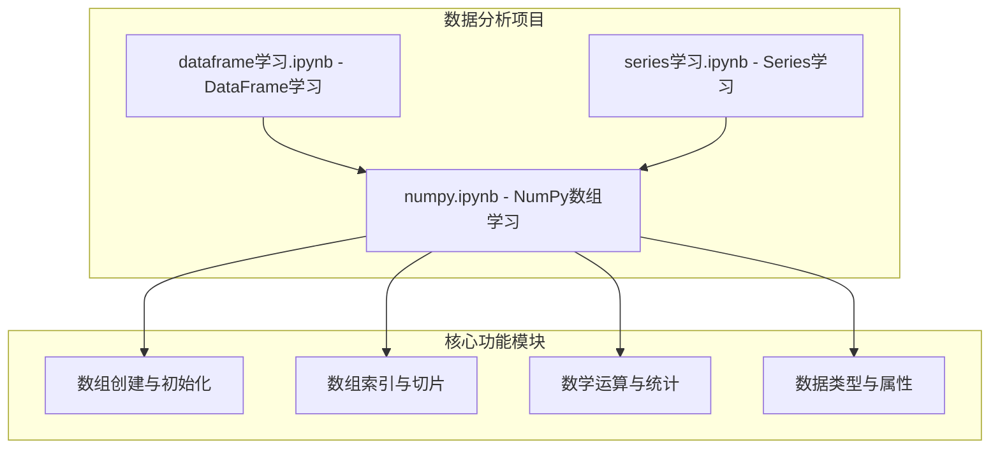
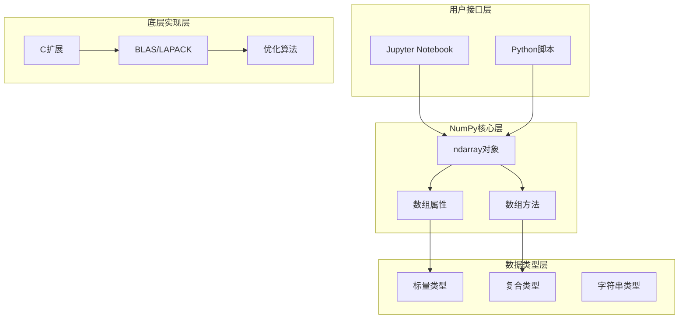
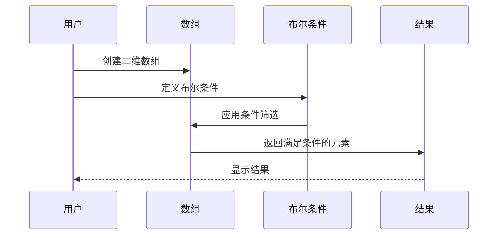
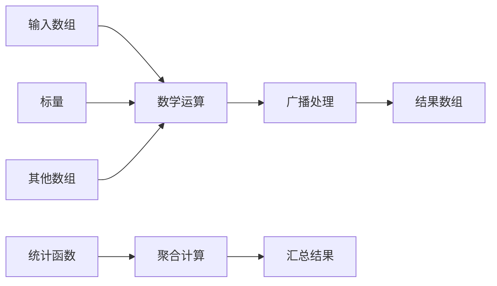
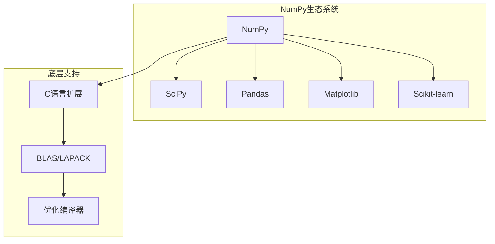
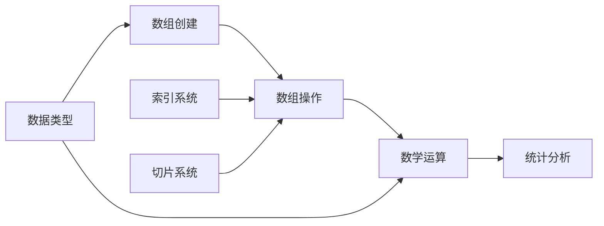

# NumPy数组学习

<cite>
**本文档引用的文件**
- [numpy.ipynb](file://数据分析matpliotlib/numpy.ipynb)
- [dataframe学习.ipynb](file://数据分析matpliotlib/dataframe学习.ipynb)
- [series学习.ipynb](file://数据分析matpliotlib/series学习.ipynb)
</cite>

## 目录
1. [简介](#简介)
2. [项目结构](#项目结构)
3. [核心组件](#核心组件)
4. [架构概览](#架构概览)
5. [详细组件分析](#详细组件分析)
6. [依赖关系分析](#依赖关系分析)
7. [性能考虑](#性能考虑)
8. [故障排除指南](#故障排除指南)
9. [结论](#结论)
10. [附录](#附录)

## 简介

本教程专注于NumPy数组的学习和应用，这是一个专为数据科学和数值计算设计的强大Python库。NumPy提供了高效的多维数组对象和丰富的数学函数，是数据科学生态系统的核心组件。

本教程将深入讲解NumPy数组的基础概念、创建方法、索引和切片操作、数学运算、统计函数以及性能优化技巧。通过实际的代码示例和详细的解释，帮助初学者理解数组在数据科学中的核心作用，同时为有经验的用户提供高级特性和内存管理知识。

## 项目结构

该项目采用Jupyter Notebook格式组织，包含三个主要的学习模块：



**图表来源**
- [numpy.ipynb:1-746](file://数据分析matpliotlib/numpy.ipynb#L1-L746)
- [dataframe学习.ipynb:1-357](file://数据分析matpliotlib/dataframe学习.ipynb#L1-L357)
- [series学习.ipynb:1-92](file://数据分析matpliotlib/series学习.ipynb#L1-L92)

**章节来源**
- [numpy.ipynb:1-746](file://数据分析matpliotlib/numpy.ipynb#L1-L746)
- [dataframe学习.ipynb:1-357](file://数据分析matpliotlib/dataframe学习.ipynb#L1-L357)
- [series学习.ipynb:1-92](file://数据分析matpliotlib/series学习.ipynb#L1-L92)

## 核心组件

### 数组基础概念

NumPy的核心是`ndarray`对象，它具有以下关键特性：

1. **多维性**: 支持0维到N维数组
2. **同质性**: 数组中的元素必须是相同的数据类型
3. **连续内存存储**: 提供高效的内存布局
4. **向量化操作**: 支持批量数学运算

### 数组创建方法

项目展示了多种创建NumPy数组的方法：

```mermaid
flowchart TD
A[数组创建方法] --> B[基础创建]
A --> C[预定义初始化]
A --> D[随机数生成]
A --> E[特殊矩阵]
B --> B1[np.array()]
B --> B2[从列表创建]
C --> C1[全零数组]
C --> C2[全一数组]
C --> C3[固定值数组]
C --> C4[空数组]
D --> D1[均匀分布]
D --> D2[正态分布]
D --> D3[整数分布]
E --> E1[单位矩阵]
E --> E2[对角矩阵]
E --> E3[随机矩阵]
```

**图表来源**
- [numpy.ipynb:206-389](file://数据分析matpliotlib/numpy.ipynb#L206-L389)

**章节来源**
- [numpy.ipynb:53-161](file://数据分析matpliotlib/numpy.ipynb#L53-L161)
- [numpy.ipynb:206-389](file://数据分析matpliotlib/numpy.ipynb#L206-L389)

## 架构概览

NumPy数组系统可以分为以下几个层次：



**图表来源**
- [numpy.ipynb:48-746](file://数据分析matpliotlib/numpy.ipynb#L48-L746)

## 详细组件分析

### 数组属性系统

NumPy数组具有多个重要的属性，用于描述数组的结构和特征：

| 属性 | 描述 | 示例 |
|------|------|------|
| `ndim` | 数组的维度数量 | 0维、1维、2维等 |
| `shape` | 数组各维度的大小 | (3, 4)表示3行4列 |
| `size` | 数组元素的总数量 | 所有维度的乘积 |
| `dtype` | 数组元素的数据类型 | int32、float64、bool等 |
| `itemsize` | 单个元素的字节数 | 4字节（int32） |
| `nbytes` | 数组占用的总字节数 | itemsize × size |

**章节来源**
- [numpy.ipynb:62-91](file://数据分析matpliotlib/numpy.ipynb#L62-L91)

### 索引和切片操作

NumPy提供了灵活的索引和切片机制：

#### 基础索引
- 使用逗号分隔的索引来访问多维数组元素
- 支持负索引，从末尾开始计数
- 可以使用冒号进行范围选择

#### 高级索引技术
- **布尔索引**: 使用布尔数组过滤元素
- **花式索引**: 使用整数数组选择特定位置
- **组合索引**: 结合多种索引方式



**图表来源**
- [numpy.ipynb:532-549](file://数据分析matpliotlib/numpy.ipynb#L532-L549)

**章节来源**
- [numpy.ipynb:506-551](file://数据分析matpliotlib/numpy.ipynb#L506-L551)

### 数学运算系统

NumPy支持丰富的数学运算：

#### 算术运算
- 标量运算：与单个数值进行运算
- 数组运算：对应元素间的运算
- 广播机制：不同形状数组的自动扩展

#### 统计函数
- 基本统计：求和、平均值、中位数
- 分布统计：方差、标准差、分位数
- 累积函数：累积和、累积积



**图表来源**
- [numpy.ipynb:566-671](file://数据分析matpliotlib/numpy.ipynb#L566-L671)

**章节来源**
- [numpy.ipynb:566-722](file://数据分析matpliotlib/numpy.ipynb#L566-L722)

### 数据类型系统

NumPy支持多种数据类型：

| 类型类别 | 具体类型 | 字节数 | 描述 |
|----------|----------|--------|------|
| 整数 | int8, int16, int32, int64 | 1, 2, 4, 8 | 有符号整数 |
| 无符号整数 | uint8, uint16, uint32, uint64 | 1, 2, 4, 8 | 无符号整数 |
| 浮点数 | float16, float32, float64 | 2, 4, 8 | 浮点数 |
| 复数 | complex64, complex128 | 8, 16 | 复数 |
| 布尔值 | bool | 1 | 布尔逻辑值 |
| 字符串 | U1, U10, ... | 可变 | Unicode字符串 |

**章节来源**
- [numpy.ipynb:176-190](file://数据分析matpliotlib/numpy.ipynb#L176-L190)

## 依赖关系分析

### 外部依赖



**图表来源**
- [numpy.ipynb:48-48](file://数据分析matpliotlib/numpy.ipynb#L48-L48)

### 内部模块依赖



**章节来源**
- [numpy.ipynb:48-746](file://数据分析matpliotlib/numpy.ipynb#L48-L746)

## 性能考虑

### 内存优化策略

1. **数据类型选择**: 选择合适的数据类型以减少内存占用
2. **数组形状优化**: 合理设计数组形状以提高缓存效率
3. **视图vs副本**: 区分视图和副本以避免不必要的内存分配

### 计算效率优化

1. **向量化操作**: 避免Python循环，使用NumPy内置函数
2. **广播机制**: 利用广播避免显式循环
3. **内存布局**: 理解C连续和F连续的区别

### 最佳实践建议

- 使用适当的数组形状和数据类型
- 避免创建不必要的中间数组
- 利用NumPy的内置函数而非Python原生循环
- 在可能的情况下使用就地操作

## 故障排除指南

### 常见问题及解决方案

#### 广播错误
**问题**: 形状不兼容导致的广播异常
**解决方案**: 检查数组形状，确保最后一个维度兼容

#### 内存不足
**问题**: 处理大型数组时内存溢出
**解决方案**: 考虑使用更高效的数据类型或分块处理

#### 类型转换问题
**问题**: 不同数据类型混合导致的类型提升
**解决方案**: 显式指定数据类型或进行类型转换

**章节来源**
- [numpy.ipynb:602-620](file://数据分析matpliotlib/numpy.ipynb#L602-L620)

## 结论

NumPy数组作为数据科学的核心工具，提供了高效、灵活的多维数组操作能力。通过本教程的学习，您应该能够：

1. 理解NumPy数组的基本概念和优势
2. 掌握各种数组创建和初始化方法
3. 熟练使用索引和切片操作
4. 进行高效的数学运算和统计分析
5. 应用性能优化技巧提升计算效率

NumPy不仅适合初学者入门，也为高级用户提供了丰富的功能和优化选项。随着对NumPy的深入理解和实践，您将在数据科学和数值计算领域获得强大的工具支持。

## 附录

### 快速参考表

#### 常用数组创建函数
- `np.array()`: 从现有数据创建数组
- `np.zeros()`: 创建全零数组
- `np.ones()`: 创建全一数组
- `np.empty()`: 创建空数组
- `np.random.random()`: 创建随机数组

#### 常用数学函数
- `np.sum()`: 求和
- `np.mean()`: 平均值
- `np.std()`: 标准差
- `np.sqrt()`: 平方根
- `np.exp()`: 指数函数

#### 常用统计函数
- `np.min()`, `np.max()`: 最小值、最大值
- `np.argmin()`, `np.argmax()`: 最小值、最大值索引
- `np.percentile()`: 分位数
- `np.median()`: 中位数

### 学习路径建议

1. **基础阶段**: 学习数组创建和基本属性
2. **进阶阶段**: 掌握索引和切片操作
3. **高级阶段**: 理解广播机制和数学运算
4. **专业阶段**: 应用统计函数和性能优化