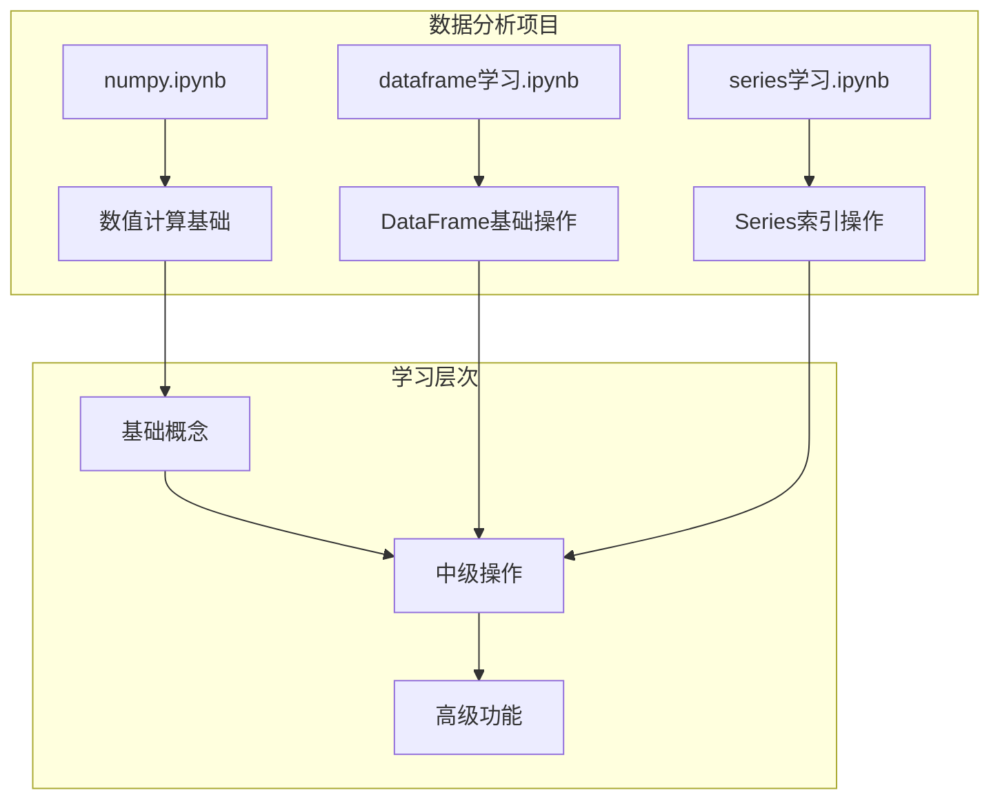
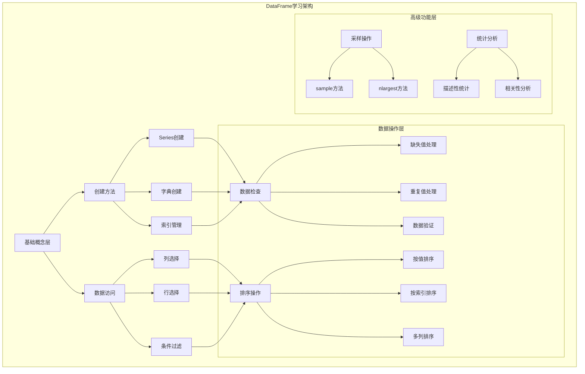
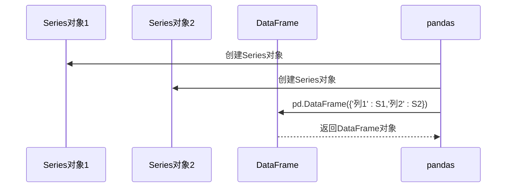
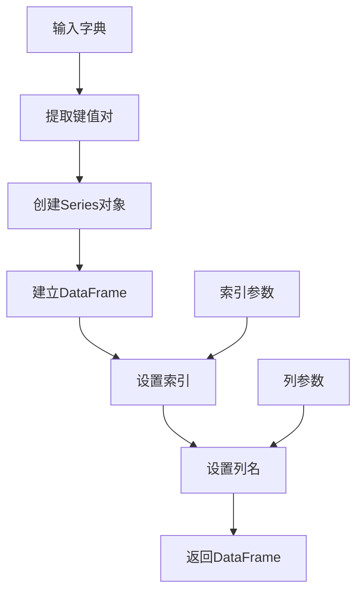
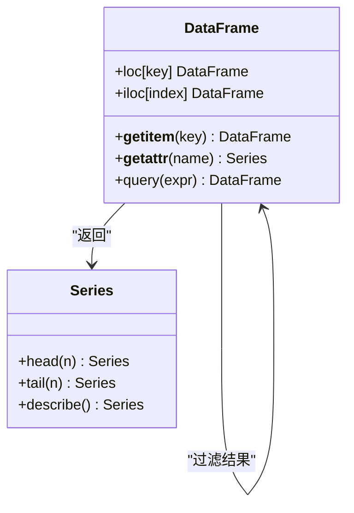
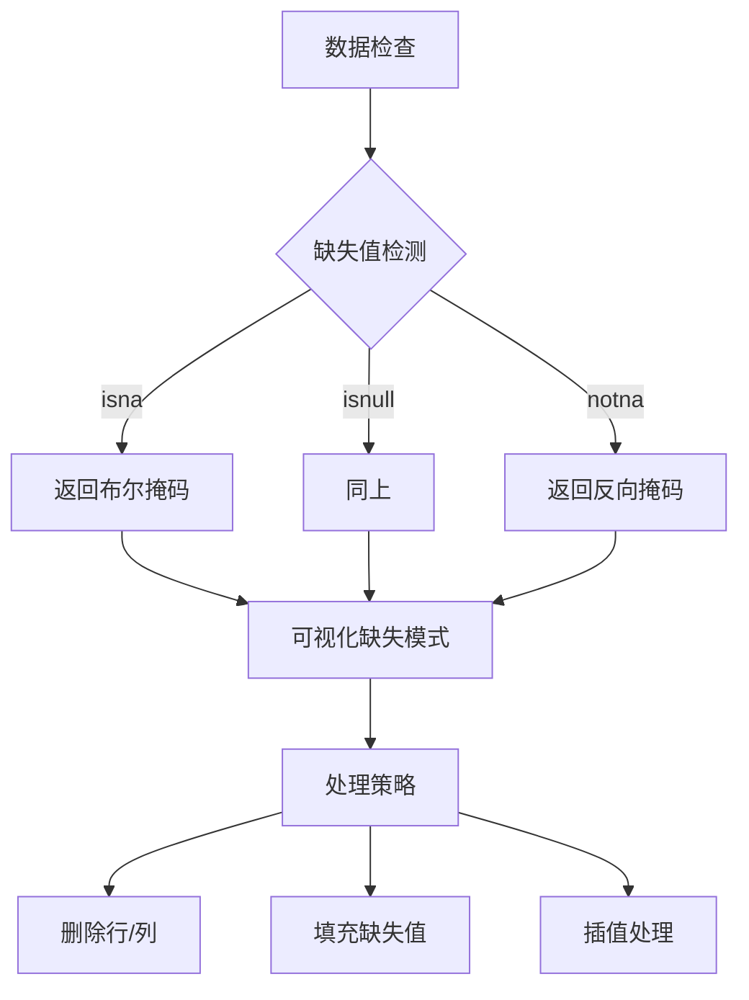
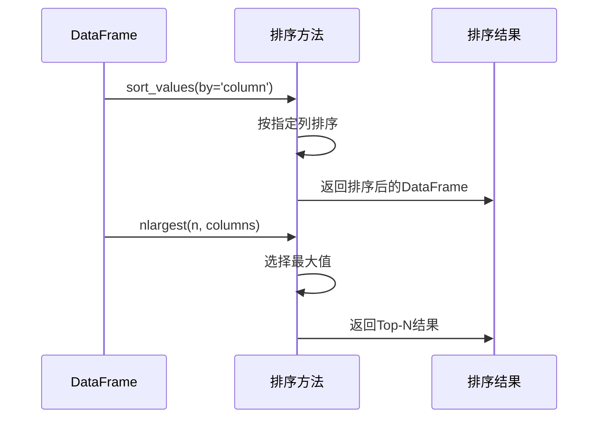
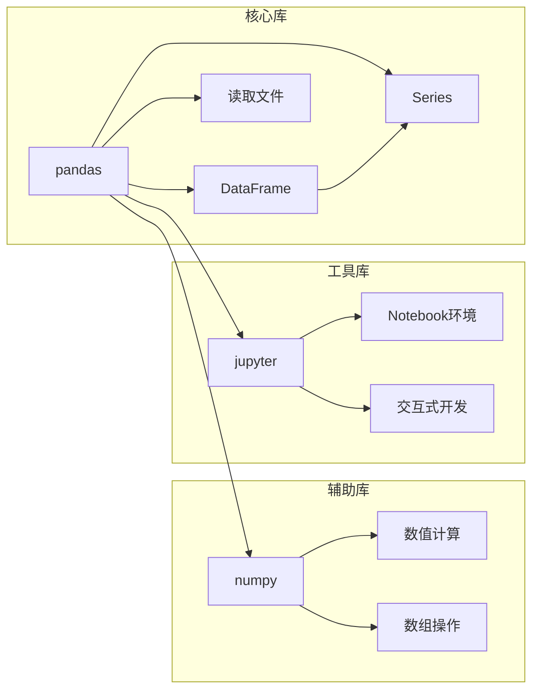
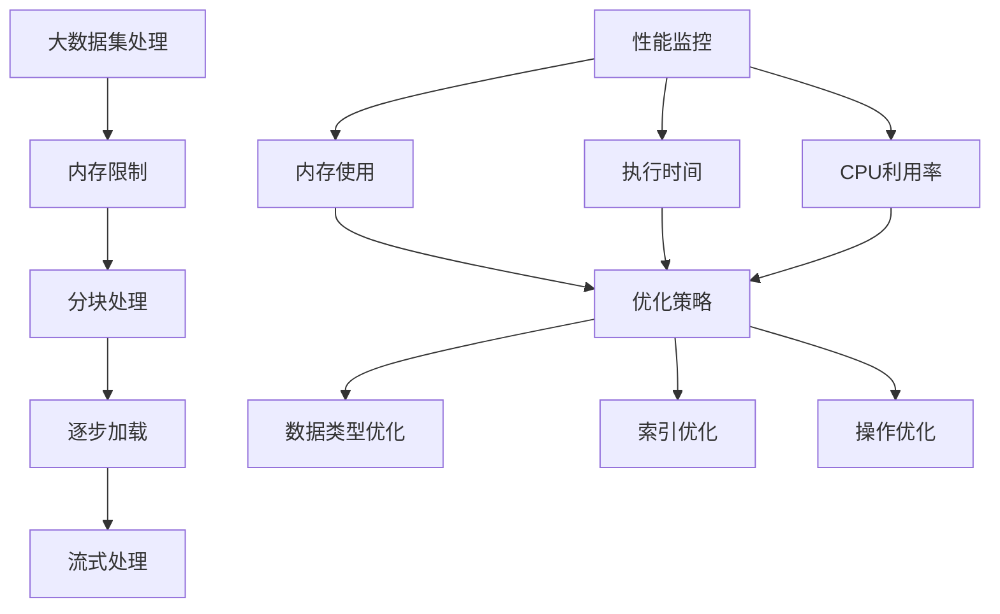
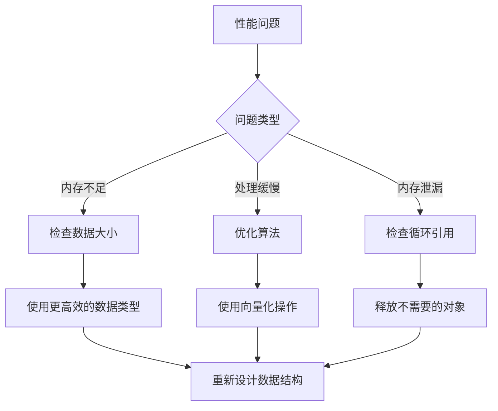

# Pandas DataFrame学习

<cite>
**本文档引用的文件**
- [dataframe学习.ipynb](file://数据分析matpliotlib/dataframe学习.ipynb)
- [series学习.ipynb](file://数据分析matpliotlib/series学习.ipynb)
- [numpy.ipynb](file://数据分析matpliotlib/numpy.ipynb)
</cite>

## 目录
1. [简介](#简介)
2. [项目结构](#项目结构)
3. [核心组件](#核心组件)
4. [架构概览](#架构概览)
5. [详细组件分析](#详细组件分析)
6. [依赖关系分析](#依赖关系分析)
7. [性能考虑](#性能考虑)
8. [故障排除指南](#故障排除指南)
9. [结论](#结论)

## 简介

本教程旨在为初学者和有经验的用户创建一个全面的Pandas DataFrame学习指南。通过分析现有的Jupyter Notebook代码库，我们将系统地介绍DataFrame的创建方法、数据查询和过滤技术、数据选择、分组和聚合操作，以及数据清洗和预处理的实际案例。

Pandas是Python中最强大的数据分析库之一，DataFrame作为其核心数据结构，提供了灵活而高效的数据操作能力。本教程将结合实际代码示例，帮助读者掌握从基础到高级的DataFrame使用技巧。

## 项目结构

该项目采用Jupyter Notebook格式组织，包含三个主要学习文件：



**图表来源**
- [dataframe学习.ipynb:1-357](file://数据分析matpliotlib/dataframe学习.ipynb#L1-L357)
- [series学习.ipynb:1-92](file://数据分析matpliotlib/series学习.ipynb#L1-L92)
- [numpy.ipynb:1-746](file://数据分析matpliotlib/numpy.ipynb#L1-L746)

**章节来源**
- [dataframe学习.ipynb:1-357](file://数据分析matpliotlib/dataframe学习.ipynb#L1-L357)
- [series学习.ipynb:1-92](file://数据分析matpliotlib/series学习.ipynb#L1-L92)
- [numpy.ipynb:1-746](file://数据分析matpliotlib/numpy.ipynb#L1-L746)

## 核心组件

### DataFrame基础创建方法

根据现有代码分析，DataFrame的创建主要有以下几种方式：

1. **从Series创建**
2. **从字典创建**
3. **指定索引和列名**

```mermaid
flowchart TD
A[创建DataFrame] --> B{数据源类型}
B --> |Series对象| C[pd.DataFrame({'列名':Series对象})]
B --> |字典| D[pd.DataFrame(字典, index, columns)]
B --> |列表| E[pd.DataFrame(二维列表)]
C --> F[自动索引生成]
D --> G[自定义索引和列名]
E --> H[默认数值索引]
F --> I[返回DataFrame对象]
G --> I
H --> I
```

**图表来源**
- [dataframe学习.ipynb:16-23](file://数据分析matpliotlib/dataframe学习.ipynb#L16-L23)

### 数据查询和过滤技术

现有代码展示了多种数据查询和过滤方法：

1. **基本数据访问**
   - 列选择：`df['列名']` 和 `df.列名`
   - 布尔索引：`df[df.列名 > 阈值]`

2. **数据检查方法**
   - 缺失值检测：`df.isna()`
   - 重复值检测：`df.duplicated()`
   - 值存在性检查：`df.isin([值])`

**章节来源**
- [dataframe学习.ipynb:48-127](file://数据分析matpliotlib/dataframe学习.ipynb#L48-L127)
- [dataframe学习.ipynb:135-167](file://数据分析matpliotlib/dataframe学习.ipynb#L135-L167)

## 架构概览

基于现有代码的分析，我们可以构建一个DataFrame学习的知识架构：



**图表来源**
- [dataframe学习.ipynb:16-23](file://数据分析matpliotlib/dataframe学习.ipynb#L16-L23)
- [dataframe学习.ipynb:48-127](file://数据分析matpliotlib/dataframe学习.ipynb#L48-L127)
- [dataframe学习.ipynb:135-327](file://数据分析matpliotlib/dataframe学习.ipynb#L135-L327)

## 详细组件分析

### DataFrame创建方法详解

#### 从Series创建DataFrame



**图表来源**
- [dataframe学习.ipynb:16-23](file://数据分析matpliotlib/dataframe学习.ipynb#L16-L23)

#### 从字典创建DataFrame



**图表来源**
- [dataframe学习.ipynb:20-22](file://数据分析matpliotlib/dataframe学习.ipynb#L20-L22)

**章节来源**
- [dataframe学习.ipynb:16-23](file://数据分析matpliotlib/dataframe学习.ipynb#L16-L23)

### 数据查询和过滤技术

#### 基本数据访问模式



**图表来源**
- [dataframe学习.ipynb:48-127](file://数据分析matpliotlib/dataframe学习.ipynb#L48-L127)

#### 布尔索引实现流程

```mermaid
flowchart TD
A[原始DataFrame] --> B[条件表达式]
B --> C[生成布尔掩码]
C --> D[应用掩码过滤]
D --> E[返回筛选结果]
F[条件示例] --> B
G[df.column > threshold] --> B
H[df.isin(values)] --> B
I[df.notna()] --> B
```

**图表来源**
- [dataframe学习.ipynb:50-54](file://数据分析matpliotlib/dataframe学习.ipynb#L50-L54)

**章节来源**
- [dataframe学习.ipynb:48-127](file://数据分析matpliotlib/dataframe学习.ipynb#L48-L127)

### 数据检查和清理功能

#### 缺失值检测和处理



**图表来源**
- [dataframe学习.ipynb:137-142](file://数据分析matpliotlib/dataframe学习.ipynb#L137-L142)

#### 重复值检测和处理

```mermaid
flowchart TD
A[重复值检测] --> B[duplicated()]
B --> C[subset参数]
C --> D[keep参数]
D --> E{keep参数}
E --> |first| F[保留第一次出现]
E --> |last| G[保留最后一次出现]
E --> |False| H[全部标记为重复]
F --> I[删除重复项]
G --> I
H --> I
I --> J[重置索引]
```

**图表来源**
- [dataframe学习.ipynb:177-179](file://数据分析matpliotlib/dataframe学习.ipynb#L177-L179)

**章节来源**
- [dataframe学习.ipynb:135-191](file://数据分析matpliotlib/dataframe学习.ipynb#L135-L191)

### 排序和采样操作

#### 排序功能实现



**图表来源**
- [dataframe学习.ipynb:257-259](file://数据分析matpliotlib/dataframe学习.ipynb#L257-L259)

#### 采样操作流程

```mermaid
flowchart TD
A[数据采样] --> B[sample(n)]
B --> C[随机选择n行]
C --> D[返回采样结果]
E[sample(frac)] --> F[按比例采样]
F --> G[frac参数控制比例]
G --> H[返回相应比例的数据]
I[sample(weights)] --> J[加权采样]
J --> K[根据权重进行采样]
K --> L[返回加权采样结果]
```

**图表来源**
- [dataframe学习.ipynb:178-179](file://数据分析matpliotlib/dataframe学习.ipynb#L178-L179)

**章节来源**
- [dataframe学习.ipynb:248-327](file://数据分析matpliotlib/dataframe学习.ipynb#L248-L327)

## 依赖关系分析

### 核心依赖关系



**图表来源**
- [dataframe学习.ipynb:14-15](file://数据分析matpliotlib/dataframe学习.ipynb#L14-L15)
- [series学习.ipynb:12-13](file://数据分析matpliotlib/series学习.ipynb#L12-L13)

### 版本兼容性

根据代码分析，项目使用的是较新的Python版本（2.7.6），这表明：
- 支持现代Python语法特性
- 可以使用最新的pandas功能
- 具备良好的向后兼容性

**章节来源**
- [dataframe学习.ipynb:341-352](file://数据分析matpliotlib/dataframe学习.ipynb#L341-L352)
- [series学习.ipynb:70-88](file://数据分析matpliotlib/series学习.ipynb#L70-L88)

## 性能考虑

### 内存优化策略

基于现有代码的分析，可以总结出以下性能优化建议：

1. **数据类型优化**
   - 使用适当的数据类型减少内存占用
   - 对分类数据使用category类型

2. **索引优化**
   - 合理设置索引提高查询效率
   - 使用多级索引进行复杂查询

3. **操作优化**
   - 批量操作优于循环操作
   - 向量化操作优于逐元素操作

### 处理大数据集的建议



## 故障排除指南

### 常见问题和解决方案

#### 数据类型相关问题

| 问题类型 | 症状 | 解决方案 |
|---------|------|----------|
| 类型不匹配 | 运算时报错 | 使用`astype()`转换数据类型 |
| 缺失值处理 | 统计结果异常 | 使用`fillna()`或`dropna()`处理 |
| 索引错误 | KeyError | 检查索引名称和类型 |

#### 性能问题诊断



**章节来源**
- [dataframe学习.ipynb:137-191](file://数据分析matpliotlib/dataframe学习.ipynb#L137-L191)

### 调试技巧

1. **使用`info()`查看数据结构**
2. **使用`describe()`获取统计摘要**
3. **使用`head()`和`tail()`检查数据边界**
4. **使用`shape`确认数据维度**

## 结论

通过分析现有的Jupyter Notebook代码库，我们构建了一个全面的Pandas DataFrame学习体系。该体系涵盖了从基础创建方法到高级操作的完整学习路径。

### 学习成果

完成本教程后，学习者将能够：

1. **熟练掌握DataFrame的创建方法**，包括从不同数据源创建DataFrame
2. **灵活运用数据查询和过滤技术**，包括多种索引方式和条件筛选
3. **有效进行数据检查和清理**，处理缺失值、重复值等问题
4. **执行排序和采样操作**，满足不同的数据分析需求
5. **理解性能优化策略**，提高大数据集处理效率

### 进一步学习建议

1. **深入学习高级功能**：pivot_table、merge、groupby等
2. **探索文件读写**：CSV、Excel、JSON等格式的处理
3. **掌握可视化技术**：matplotlib、seaborn等绘图库
4. **学习机器学习应用**：将DataFrame用于建模和预测

本教程为初学者提供了循序渐进的学习路径，同时为有经验的用户准备了高级特性和性能优化技巧，确保每个层次的学习者都能从中获益。