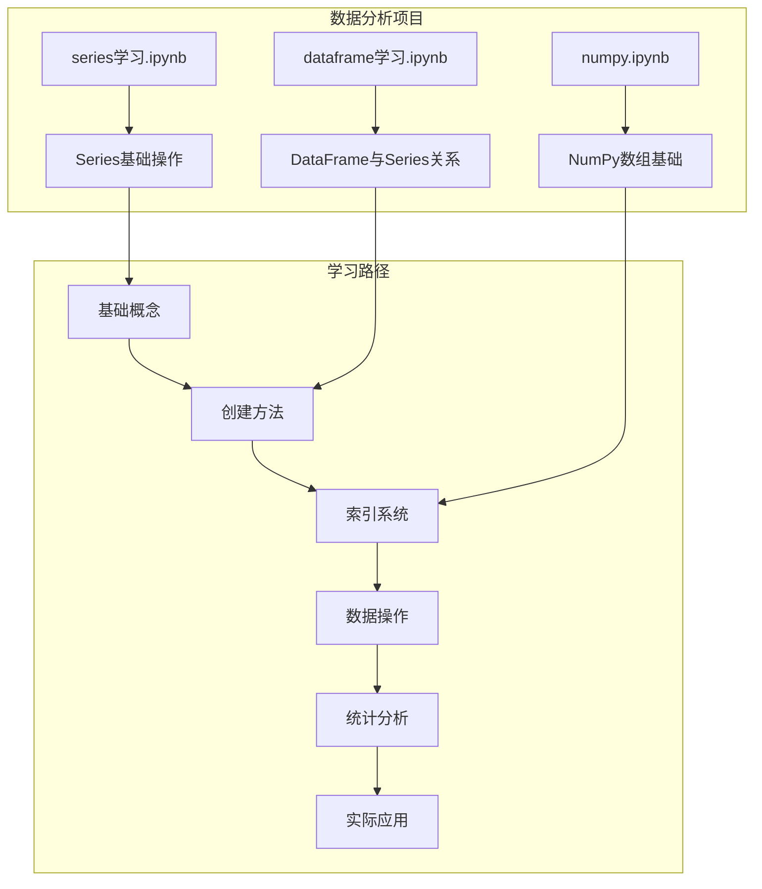
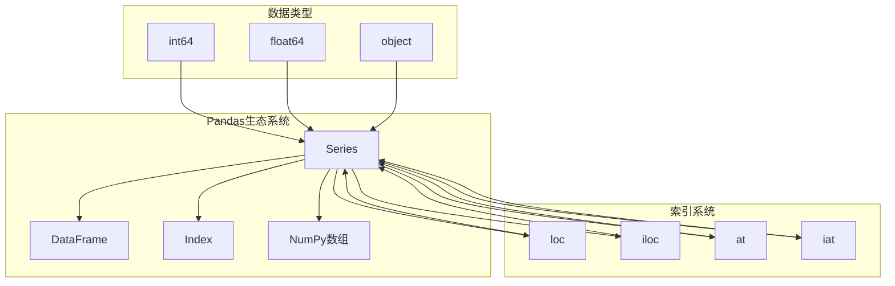
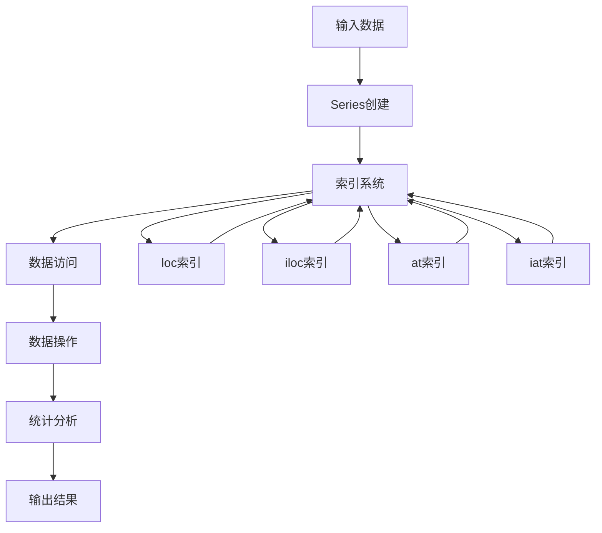
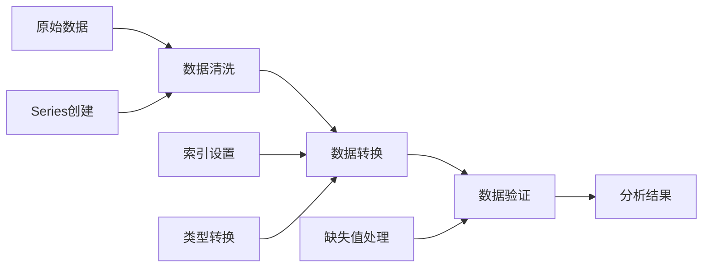
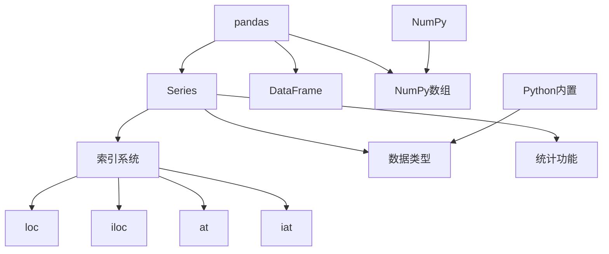

# Pandas Series学习

<cite>
**本文档引用的文件**
- [series学习.ipynb](file://数据分析matpliotlib/series学习.ipynb)
- [dataframe学习.ipynb](file://数据分析matpliotlib/dataframe学习.ipynb)
- [numpy.ipynb](file://数据分析matpliotlib/numpy.ipynb)
</cite>

## 目录
1. [简介](#简介)
2. [项目结构](#项目结构)
3. [核心组件](#核心组件)
4. [架构概览](#架构概览)
5. [详细组件分析](#详细组件分析)
6. [依赖关系分析](#依赖关系分析)
7. [性能考虑](#性能考虑)
8. [故障排除指南](#故障排除指南)
9. [结论](#结论)
10. [附录](#附录)

## 简介

本教程专注于Pandas Series数据结构的学习和应用。Series是Pandas的核心数据结构之一，它是一维的、带标签的数据数组，可以存储任何数据类型。本教程将从基础概念开始，逐步深入到高级特性和最佳实践，帮助不同层次的用户掌握Series的使用方法。

通过本教程，您将学会：
- Series的创建和初始化方法
- 索引系统的使用和区别
- 数据访问、筛选和过滤技巧
- 数学运算和统计分析功能
- 数据类型转换和缺失值处理
- 实际案例演示Series在数据预处理和分析中的应用

## 项目结构

该项目采用Jupyter Notebook的形式组织学习内容，每个主题都有专门的笔记本文件：



**图表来源**
- [series学习.ipynb:1-92](file://数据分析matpliotlib/series学习.ipynb#L1-L92)
- [dataframe学习.ipynb:1-357](file://数据分析matpliotlib/dataframe学习.ipynb#L1-L357)
- [numpy.ipynb:1-746](file://数据分析matpliotlib/numpy.ipynb#L1-L746)

**章节来源**
- [series学习.ipynb:1-92](file://数据分析matpliotlib/series学习.ipynb#L1-L92)
- [dataframe学习.ipynb:1-357](file://数据分析matpliotlib/dataframe学习.ipynb#L1-L357)
- [numpy.ipynb:1-746](file://数据分析matpliotlib/numpy.ipynb#L1-L746)

## 核心组件

### Series数据结构概述

Series是Pandas的一维数组结构，具有以下核心特征：

- **标签化索引**：每个元素都有对应的标签
- **同质数据类型**：同一Series中的数据类型相同
- **灵活的索引方式**：支持位置索引和标签索引
- **内置统计功能**：提供丰富的统计计算方法

### 主要创建方法

根据学习笔记，Series可以通过多种方式创建：

1. **从列表创建**：最简单直接的方式
2. **从字典创建**：使用字典的键作为索引
3. **从NumPy数组创建**：继承NumPy的数组特性
4. **自定义索引**：指定特定的索引标签

**章节来源**
- [series学习.ipynb:13-27](file://数据分析matpliotlib/series学习.ipynb#L13-L27)

## 架构概览

### Series与相关组件的关系



**图表来源**
- [series学习.ipynb:22-25](file://数据分析matpliotlib/series学习.ipynb#L22-L25)
- [dataframe学习.ipynb:16-23](file://数据分析matpliotlib/dataframe学习.ipynb#L16-L23)

### 数据流架构



**图表来源**
- [series学习.ipynb:13-27](file://数据分析matpliotlib/series学习.ipynb#L13-L27)

## 详细组件分析

### Series创建和初始化

#### 基础创建方法

Series的创建提供了多种灵活性，可以根据不同的需求选择合适的方法：

**从列表创建Series**
```python
# 最简单的创建方式
s = pd.Series([1, 3, 5, 7, 9])
```

**自定义索引的Series**
```python
# 指定自定义索引
s = pd.Series([1, 3, 5, 7, 9], index=['a', 'b', 'c', 'd', 'e'])
```

**命名Series**
```python
# 为Series设置名称
s = pd.Series([1, 3, 5, 7, 9], index=['a', 'b', 'c', 'd', 'e'], name='num')
```

#### 高级创建选项

**动态添加元素**
```python
# 可以动态添加新的索引和值
s['f'] = 6
```

**章节来源**
- [series学习.ipynb:13-21](file://数据分析matpliotlib/series学习.ipynb#L13-L21)

### 索引系统详解

#### loc vs iloc 的区别

索引系统是Series的核心功能之一，提供了多种索引方式：

**loc索引（标签索引）**
- 使用原始索引标签进行访问
- 适用于需要按标签访问的场景
- 返回对应标签的值或子Series

**iloc索引（位置索引）**
- 使用数值位置进行访问
- 适用于需要按位置访问的场景
- 基于0的索引系统

**at vs iat的区别**
- `at`用于单个标量值的快速访问
- `iat`用于基于位置的单个标量值访问

#### 索引访问示例

```python
# 标签索引访问
print(s.loc['a'])  # 访问标签'a'对应的值

# 位置索引访问  
print(s.iloc[3])   # 访问第4个位置的值

# 单个值的快速访问
print(s.at['a'])   # 快速访问标签'a'
print(s.iat[3])    # 快速访问位置3
```

**章节来源**
- [series学习.ipynb:22-25](file://数据分析matpliotlib/series学习.ipynb#L22-L25)

### 数据访问、筛选和过滤

#### 基础数据访问

**基本索引操作**
```python
# 访问单个元素
value = s['a']

# 访问多个元素
subset = s[['a', 'b', 'c']]

# 切片操作
slice_data = s[1:4]
```

**DataFrame中的Series访问**
```python
# 在DataFrame中访问特定列（返回Series）
column_series = df['第一列']
column_series = df.第一列
```

#### 高级筛选技术

**布尔掩码筛选**
```python
# 基于条件的筛选
filtered_df = df[df.第一列 > 3]
```

**数据预览功能**
```python
# 查看前几行
print(s.head())

# 查看后几行
print(s.tail())
```

**章节来源**
- [series学习.ipynb:26-27](file://数据分析matpliotlib/series学习.ipynb#L26-L27)
- [dataframe学习.ipynb:49-54](file://数据分析matpliotlib/dataframe学习.ipynb#L49-L54)

### 数学运算和统计分析

#### Series的基本数学运算

Series支持向量化运算，可以对整个Series进行数学运算：

**算术运算**
```python
# 加法运算
result = s + 10

# 乘法运算  
result = s * 2

# 复杂表达式
result = (s + 5) * 2 - 3
```

#### 统计分析功能

**描述性统计**
```python
# 基本统计信息
mean_value = s.mean()      # 平均值
sum_value = s.sum()        # 求和
max_value = s.max()        # 最大值
min_value = s.min()        # 最小值
std_value = s.std()        # 标准差
```

**高级统计功能**
```python
# 排序操作
sorted_series = df.sort_values(by='name')

# 最值查找
nlargest_result = df.nlargest(2, columns=['age', 'score'])
```

**章节来源**
- [dataframe学习.ipynb:257-258](file://数据分析matpliotlib/dataframe学习.ipynb#L257-L258)

### 数据类型转换和缺失值处理

#### 数据类型转换

Series提供了灵活的数据类型转换能力：

**类型转换方法**
```python
# 转换为不同数据类型
float_series = s.astype(float)
str_series = s.astype(str)
```

**数据类型检查**
```python
# 检查Series的数据类型
print(s.dtype)
```

#### 缺失值处理

**缺失值检测**
```python
# 检测缺失值
is_na = df.isna()          # 检测空值
is_in = df.isin([20])       # 检测特定值
```

**缺失值处理策略**
```python
# 删除缺失值
cleaned_df = df.dropna()

# 填充缺失值
filled_df = df.fillna(value=0)

# 前向填充
forward_filled = df.fillna(method='ffill')
```

**章节来源**
- [dataframe学习.ipynb:140-141](file://数据分析matpliotlib/dataframe学习.ipynb#L140-L141)

### 实际应用案例

#### 数据预处理流程



**图表来源**
- [dataframe学习.ipynb:137-141](file://数据分析matpliotlib/dataframe学习.ipynb#L137-L141)

#### 数据分析工作流程

**完整的数据分析示例**
```python
# 创建示例数据
df = pd.DataFrame({
    "name": ["张三", "李四", "王五"],
    "age": [18, 19, 20], 
    "score": [80, 90, 100]
}, index=['a', 'b', 'c'])

# 数据探索
print(df.head())
print(df.tail(1))

# 数据筛选
high_score = df[df.score > 85]

# 数据排序
sorted_df = df.sort_values(by='age')

# 统计分析
average_age = df.age.mean()
```

**章节来源**
- [dataframe学习.ipynb:137-141](file://数据分析matpliotlib/dataframe学习.ipynb#L137-L141)

## 依赖关系分析

### 内部依赖关系



**图表来源**
- [series学习.ipynb:12](file://数据分析matpliotlib/series学习.ipynb#L12)
- [dataframe学习.ipynb:14-15](file://数据分析matpliotlib/dataframe学习.ipynb#L14-L15)

### 外部依赖关系

**主要依赖库**
- **pandas**：核心数据结构和功能
- **numpy**：数值计算和数组操作
- **Python标准库**：基础数据类型和函数

**版本兼容性**
- pandas >= 1.0.0
- numpy >= 1.18.0
- Python >= 3.6

**章节来源**
- [series学习.ipynb:12](file://数据分析matpliotlib/series学习.ipynb#L12)
- [dataframe学习.ipynb:14-15](file://数据分析matpliotlib/dataframe学习.ipynb#L14-L15)

## 性能考虑

### 内存优化策略

**数据类型优化**
- 优先使用合适的整数类型（int8, int16, int32, int64）
- 对于分类数据使用category类型
- 避免不必要的对象类型

**索引优化**
- 合理设计索引结构
- 避免重复索引值
- 使用有序索引提高查询效率

### 计算性能优化

**向量化操作**
```python
# 推荐：向量化操作
result = s * 2 + 5

# 不推荐：循环操作
result = []
for item in s:
    result.append(item * 2 + 5)
```

**内存使用监控**
```python
# 检查Series内存使用
print(s.memory_usage(deep=True))
```

## 故障排除指南

### 常见问题和解决方案

**索引错误**
```python
# 问题：索引不存在
try:
    value = s['nonexistent']
except KeyError:
    print("索引不存在，请检查索引值")

# 解决方案：使用get方法
value = s.get('nonexistent', default_value)
```

**数据类型错误**
```python
# 问题：类型不匹配
try:
    numeric_result = s.astype(int)
except ValueError:
    print("无法转换为整数类型")

# 解决方案：先清理数据
cleaned_s = s.dropna().astype(int)
```

**内存不足问题**
```python
# 解决方案：分块处理大数据
chunk_size = 1000
for i in range(0, len(large_series), chunk_size):
    chunk = large_series[i:i+chunk_size]
    process_chunk(chunk)
```

**章节来源**
- [series学习.ipynb:22-27](file://数据分析matpliotlib/series学习.ipynb#L22-L27)

### 调试技巧

**数据检查方法**
```python
# 检查Series基本信息
print(s.info())
print(s.describe())
print(s.value_counts())

# 检查索引状态
print(s.index.is_unique)
print(s.index.is_monotonic_increasing)
```

## 结论

通过本教程，我们深入学习了Pandas Series的核心概念和使用方法。Series作为Pandas的基础数据结构，为数据分析提供了强大的工具和灵活性。

**关键要点总结**：
- Series提供了灵活的创建和初始化方法
- 索引系统支持多种访问模式，包括标签索引和位置索引
- 内置丰富的统计功能和数学运算能力
- 支持高效的数据类型转换和缺失值处理
- 与DataFrame形成完整的数据处理生态

**学习路径建议**：
1. 从基础创建和索引开始
2. 掌握数据访问和筛选技巧
3. 学习统计分析功能
4. 实践数据预处理应用
5. 探索高级特性和性能优化

## 附录

### 快速参考表

**Series创建方法**
| 方法 | 描述 | 示例 |
|------|------|------|
| pd.Series(data) | 从列表创建 | `pd.Series([1,2,3])` |
| pd.Series(data, index) | 自定义索引 | `pd.Series([1,2,3], ['a','b','c'])` |
| pd.Series(data, name) | 设置名称 | `pd.Series([1,2,3], name='values')` |

**索引访问方法**
| 方法 | 类型 | 用途 | 示例 |
|------|------|------|------|
| loc | 标签索引 | 按标签访问 | `s.loc['a']` |
| iloc | 位置索引 | 按位置访问 | `s.iloc[0]` |
| at | 单值访问 | 快速访问标量 | `s.at['a']` |
| iat | 单值访问 | 快速访问位置 | `s.iat[0]` |

**统计分析方法**
| 方法 | 功能 | 说明 |
|------|------|------|
| mean() | 平均值 | 计算数值平均值 |
| sum() | 求和 | 计算总和 |
| max() | 最大值 | 获取最大值 |
| min() | 最小值 | 获取最小值 |
| std() | 标准差 | 计算标准差 |
| describe() | 描述统计 | 提供完整统计摘要 |

### 进一步学习资源

**官方文档**
- [Pandas Series Documentation](https://pandas.pydata.org/docs/dev/reference/api/pandas.Series.html)
- [Pandas Indexing Documentation](https://pandas.pydata.org/docs/dev/user_guide/indexing.html)

**实践练习建议**
1. 尝试不同的Series创建方法
2. 练习各种索引访问技巧
3. 实现数据筛选和过滤
4. 探索统计分析功能
5. 构建完整的数据分析项目