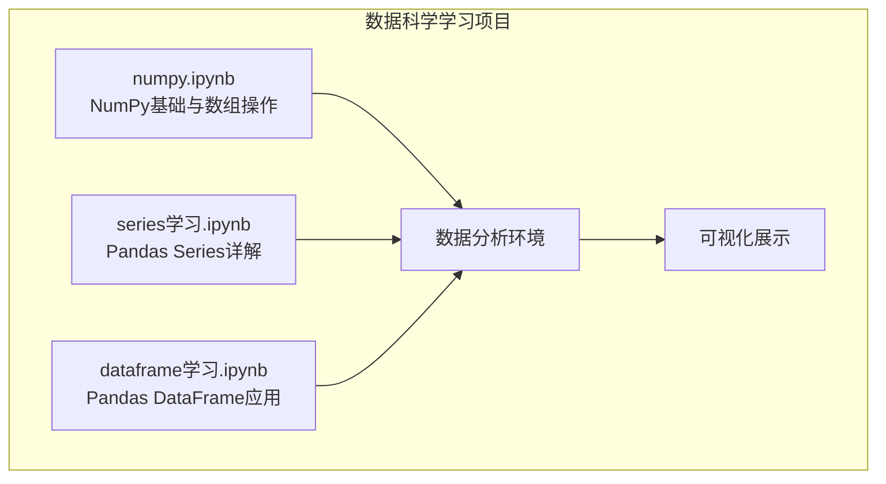
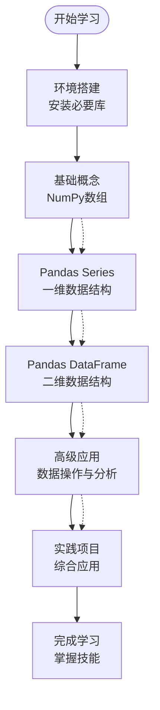
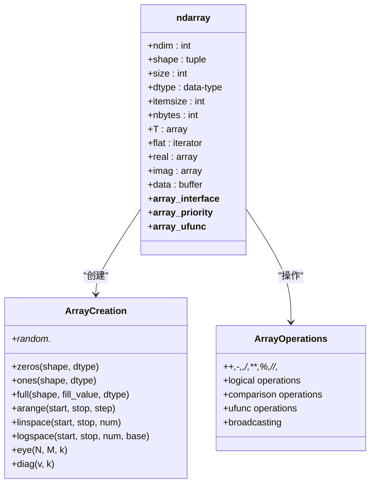
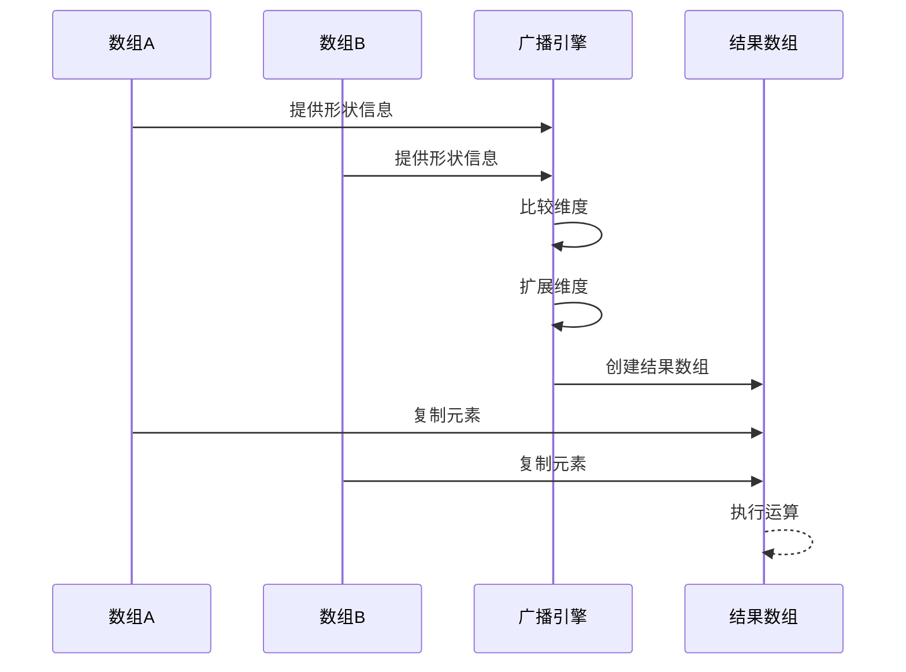
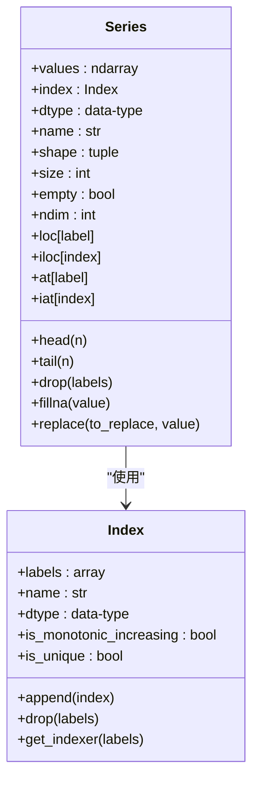
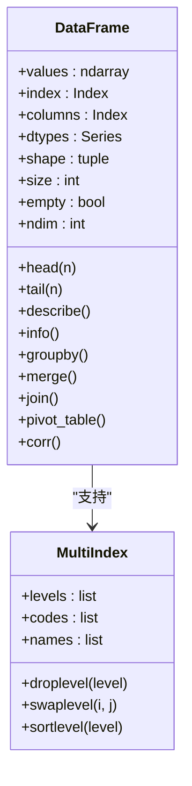
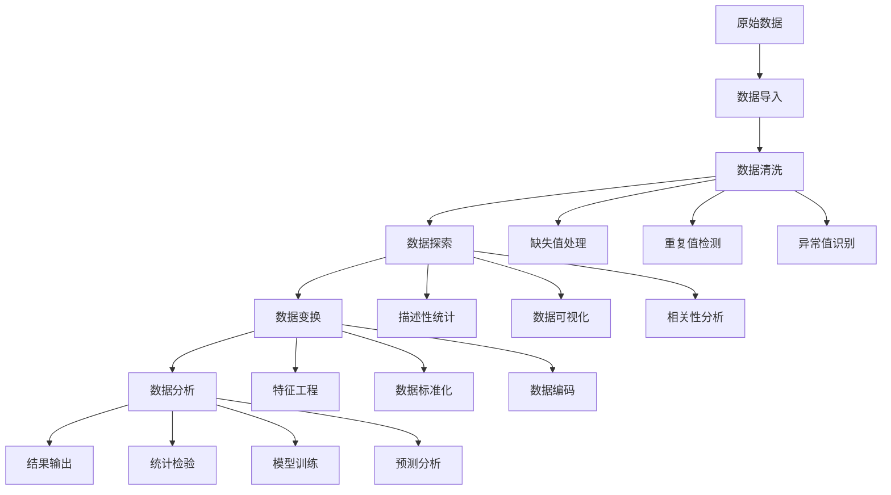
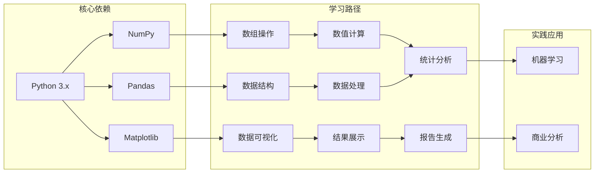

# 学习资源与扩展

<cite>
**本文档引用的文件**
- [dataframe学习.ipynb](file://数据分析matpliotlib/dataframe学习.ipynb)
- [numpy.ipynb](file://数据分析matpliotlib/numpy.ipynb)
- [series学习.ipynb](file://数据分析matpliotlib/series学习.ipynb)
</cite>

## 目录
1. [引言](#引言)
2. [项目结构](#项目结构)
3. [核心组件](#核心组件)
4. [架构概览](#架构概览)
5. [详细组件分析](#详细组件分析)
6. [依赖关系分析](#依赖关系分析)
7. [性能考虑](#性能考虑)
8. [故障排除指南](#故障排除指南)
9. [结论](#结论)
10. [附录](#附录)

## 引言

本项目是一个面向数据科学初学者的综合性学习资源，涵盖了NumPy、Pandas和Matplotlib三个核心库的基础知识和实践应用。通过三个精心设计的Jupyter Notebook文件，学习者可以系统地掌握数据科学开发环境中的关键技能。

该项目特别适合以下学习者：
- 刚接触数据科学的本科生和研究生
- 希望系统学习Python数据科学栈的编程初学者
- 需要实践练习来巩固理论知识的学生

## 项目结构

项目采用简洁而高效的学习结构，每个文件专注于特定的数据科学概念：

**图表来源**
- [numpy.ipynb:1-746](file://数据分析matpliotlib/numpy.ipynb#L1-L746)
- [series学习.ipynb:1-92](file://数据分析matpliotlib/series学习.ipynb#L1-L92)
- [dataframe学习.ipynb:1-357](file://数据分析matpliotlib/dataframe学习.ipynb#L1-L357)

**章节来源**
- [numpy.ipynb:1-746](file://数据分析matpliotlib/numpy.ipynb#L1-L746)
- [series学习.ipynb:1-92](file://数据分析matpliotlib/series学习.ipynb#L1-L92)
- [dataframe学习.ipynb:1-357](file://数据分析matpliotlib/dataframe学习.ipynb#L1-L357)

## 核心组件

### NumPy组件分析

NumPy作为数值计算的基础库，在数据科学中扮演着至关重要的角色。该组件涵盖了数组创建、索引切片、数学运算和统计分析等多个方面。

**主要功能模块：**
- **数组创建方法**：从标量、列表到复杂形状的数组创建
- **多维数组操作**：支持0维到多维数组的灵活操作
- **数组索引与切片**：高级索引技术和布尔索引
- **数学运算**：向量化操作和广播机制
- **统计函数**：丰富的统计分析工具

### Pandas组件分析

Pandas提供了高性能的数据结构和数据分析工具，是数据科学工作流的核心。

**核心数据结构：**
- **Series对象**：一维标签数组，支持自定义索引
- **DataFrame对象**：二维表格型数据结构，支持复杂的数据操作

**关键功能：**
- 数据导入导出和预处理
- 数据筛选、排序和分组
- 缺失值处理和数据清洗
- 统计分析和聚合操作

**章节来源**
- [numpy.ipynb:48-722](file://数据分析matpliotlib/numpy.ipynb#L48-L722)
- [series学习.ipynb:10-68](file://数据分析matpliotlib/series学习.ipynb#L10-L68)
- [dataframe学习.ipynb:13-326](file://数据分析matpliotlib/dataframe学习.ipynb#L13-L326)

## 架构概览

整个学习项目采用渐进式教学架构，从基础概念到实际应用层层递进：

**图表来源**
- [numpy.ipynb:61-160](file://数据分析matpliotlib/numpy.ipynb#L61-L160)
- [series学习.ipynb:11-27](file://数据分析matpliotlib/series学习.ipynb#L11-L27)
- [dataframe学习.ipynb:137-258](file://数据分析matpliotlib/dataframe学习.ipynb#L137-L258)

## 详细组件分析

### NumPy数组系统

NumPy的数组系统是整个数据科学栈的基石，其设计理念体现了高性能和易用性的完美结合。

#### 数组维度与特性

**图表来源**
- [numpy.ipynb:62-160](file://数据分析matpliotlib/numpy.ipynb#L62-L160)
- [numpy.ipynb:208-388](file://数据分析matpliotlib/numpy.ipynb#L208-L388)
- [numpy.ipynb:567-620](file://数据分析matpliotlib/numpy.ipynb#L567-L620)

#### 广播机制详解

广播机制是NumPy的核心特性之一，它允许不同形状的数组进行算术运算：

**图表来源**
- [numpy.ipynb:602-606](file://数据分析matpliotlib/numpy.ipynb#L602-L606)

**章节来源**
- [numpy.ipynb:61-160](file://数据分析matpliotlib/numpy.ipynb#L61-L160)
- [numpy.ipynb:208-388](file://数据分析matpliotlib/numpy.ipynb#L208-L388)
- [numpy.ipynb:567-620](file://数据分析matpliotlib/numpy.ipynb#L567-L620)

### Pandas数据结构

Pandas提供了两种主要的数据结构，每种都有其独特的应用场景和优势。

#### Series对象分析

Series是一维的标签数组，支持灵活的索引和多种数据类型：

**图表来源**
- [series学习.ipynb:11-27](file://数据分析matpliotlib/series学习.ipynb#L11-L27)

#### DataFrame对象分析

DataFrame是二维的表格型数据结构，支持复杂的行列操作：

**图表来源**
- [dataframe学习.ipynb:137-258](file://数据分析matpliotlib/dataframe学习.ipynb#L137-L258)

**章节来源**
- [series学习.ipynb:11-27](file://数据分析matpliotlib/series学习.ipynb#L11-L27)
- [dataframe学习.ipynb:137-258](file://数据分析matpliotlib/dataframe学习.ipynb#L137-L258)

### 数据操作流程

**图表来源**
- [dataframe学习.ipynb:137-258](file://数据分析matpliotlib/dataframe学习.ipynb#L137-L258)

**章节来源**
- [dataframe学习.ipynb:137-258](file://数据分析matpliotlib/dataframe学习.ipynb#L137-L258)

## 依赖关系分析

项目中的组件依赖关系清晰明确，形成了完整的数据科学学习链路：

**图表来源**
- [numpy.ipynb:48](file://数据分析matpliotlib/numpy.ipynb#L48)
- [series学习.ipynb:12](file://数据分析matpliotlib/series学习.ipynb#L12)
- [dataframe学习.ipynb:14](file://数据分析matpliotlib/dataframe学习.ipynb#L14)

**章节来源**
- [numpy.ipynb:48](file://数据分析matpliotlib/numpy.ipynb#L48)
- [series学习.ipynb:12](file://数据分析matpliotlib/series学习.ipynb#L12)
- [dataframe学习.ipynb:14](file://数据分析matpliotlib/dataframe学习.ipynb#L14)

## 性能考虑

在数据科学实践中，性能优化是确保项目成功的关键因素。以下是针对NumPy和Pandas的性能最佳实践：

### NumPy性能优化

1. **向量化操作优先**：避免Python循环，使用NumPy内置函数
2. **内存布局优化**：合理使用连续内存布局提高缓存效率
3. **数据类型选择**：根据需求选择合适的数据类型减少内存占用
4. **广播机制**：充分利用广播避免不必要的数据复制

### Pandas性能优化

1. **数据类型优化**：使用更小的数据类型存储整数和浮点数
2. **查询优化**：使用query()方法和布尔索引提高筛选效率
3. **分块处理**：对于大数据集使用chunksize参数分块处理
4. **内存管理**：及时释放不需要的大型对象，使用del关键字

## 故障排除指南

### 常见问题及解决方案

#### NumPy相关问题

**问题1：数组形状不匹配**
- **症状**：执行算术运算时出现形状错误
- **解决方案**：检查数组的shape属性，使用reshape()或resize()调整形状
- **预防措施**：在进行数组运算前验证形状兼容性

**问题2：内存溢出**
- **症状**：创建大型数组时出现MemoryError
- **解决方案**：使用适当的数据类型，考虑使用生成器或分块处理
- **预防措施**：监控数组大小和内存使用情况

#### Pandas相关问题

**问题3：索引错误**
- **症状**：loc[]和iloc[]访问时报错
- **解决方案**：确认索引名称和位置的正确性，使用index.get_loc()查找位置
- **预防措施**：在操作前打印索引信息进行验证

**问题4：数据类型混淆**
- **症状**：数值计算结果异常或类型转换错误
- **解决方案**：使用pd.to_numeric()进行显式转换，检查dtype属性
- **预防措施**：在数据导入后立即检查和验证数据类型

**章节来源**
- [numpy.ipynb:602-606](file://数据分析matpliotlib/numpy.ipynb#L602-L606)
- [series学习.ipynb:22-25](file://数据分析matpliotlib/series学习.ipynb#L22-L25)
- [dataframe学习.ipynb:50-81](file://数据分析matpliotlib/dataframe学习.ipynb#L50-L81)

## 结论

本项目为学习者提供了一个完整而系统的数据科学入门路径。通过NumPy、Pandas和Matplotlib的有机结合，学习者可以逐步掌握现代数据科学工作所需的各项技能。

项目的主要优势包括：
- **循序渐进的学习路径**：从基础概念到实际应用
- **实践导向的教学方法**：通过Jupyter Notebook提供即时反馈
- **全面的知识覆盖**：涵盖数据科学的核心概念和工具
- **实用性强**：注重解决实际问题的能力培养

建议学习者按照项目提供的顺序深入学习，并结合实际项目进行练习，以达到最佳的学习效果。

## 附录

### 进阶学习资源推荐

#### 在线学习平台
- **Coursera**: Python for Data Science and Machine Learning Bootcamp
- **edX**: Introduction to Data Science in Python
- **Udemy**: Complete Python Bootcamp: Go from zero to hero in Python
- **DataCamp**: Comprehensive Python Data Science Track

#### 官方文档
- **NumPy官方文档**: https://numpy.org/doc/
- **Pandas官方文档**: https://pandas.pydata.org/docs/
- **Matplotlib官方文档**: https://matplotlib.org/stable/contents.html

#### 扩展阅读材料
- **《Python数据科学手册》** - Jake VanderPlas
- **《利用Python进行数据分析》** - Wes McKinney
- **《统计学习方法》** - 李航
- **《机器学习实战》** - Peter Harrington

#### 实践项目建议

**初级项目（1-2周）**
1. **学生成绩分析系统**：使用Pandas分析学生成绩数据
2. **天气数据可视化**：结合Matplotlib绘制天气趋势图
3. **电商销售数据分析**：练习数据清洗和基本统计分析

**中级项目（3-4周）**
1. **股票价格预测**：结合时间序列分析和机器学习算法
2. **客户行为分析**：使用聚类分析进行客户细分
3. **文本情感分析**：结合自然语言处理技术

**高级项目（4-6周）**
1. **推荐系统构建**：实现协同过滤算法
2. **图像分类项目**：使用深度学习技术
3. **实时数据分析系统**：构建流式数据处理管道

#### 学习路径建议

**零基础学习者**
1. **第1-2周**：Python基础语法和数据类型
2. **第3-4周**：NumPy数组操作和数学运算
3. **第5-6周**：Pandas数据结构和数据操作
4. **第7-8周**：Matplotlib数据可视化
5. **第9-12周**：综合项目实践

**有编程经验学习者**
1. **第1-2周**：NumPy快速入门
2. **第3-4周**：Pandas核心功能
3. **第5-6周**：数据可视化技巧
4. **第7-8周**：机器学习基础
5. **第9-12周**：专业项目实践

#### 技能评估标准

**初级水平**
- 能够创建和操作NumPy数组
- 掌握Pandas的基本数据操作
- 能够绘制简单的数据图表
- 解决常见的数据处理问题

**中级水平**
- 熟练使用高级Pandas功能
- 能够进行复杂的数据分析
- 掌握多种可视化技术
- 具备独立完成小型项目的能力

**高级水平**
- 能够设计和实现复杂的数据分析流程
- 精通性能优化和调试技术
- 具备团队协作和项目管理能力
- 能够指导其他学习者