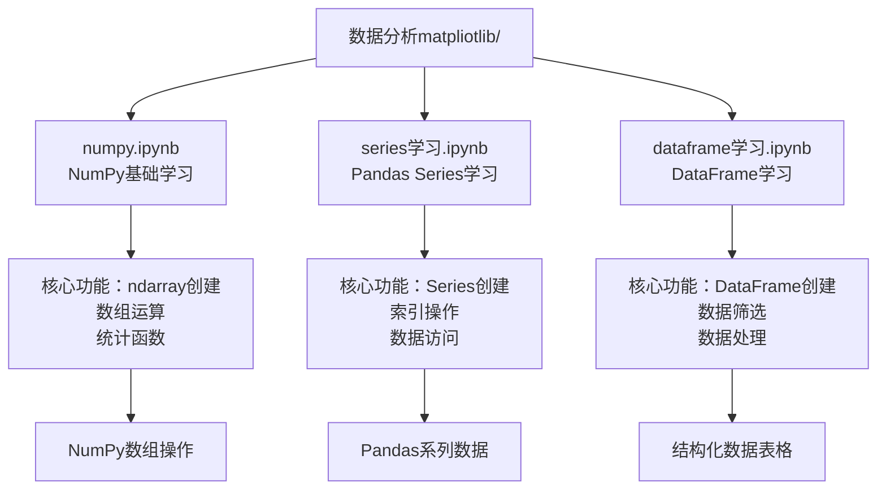
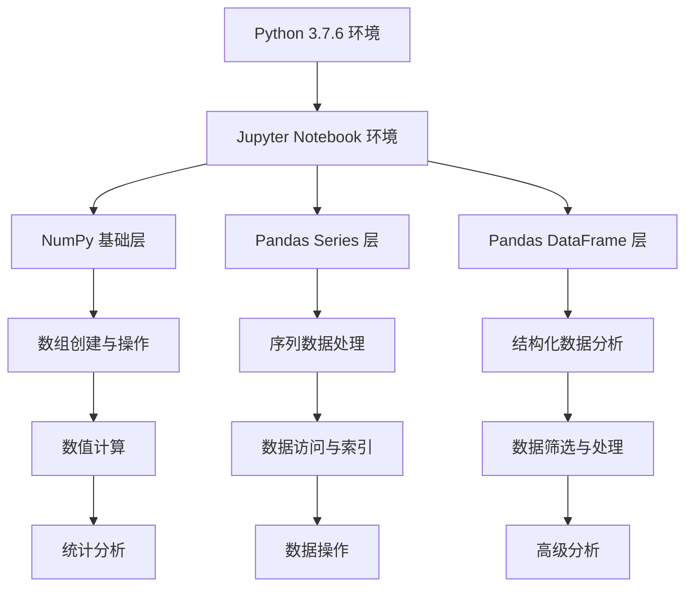
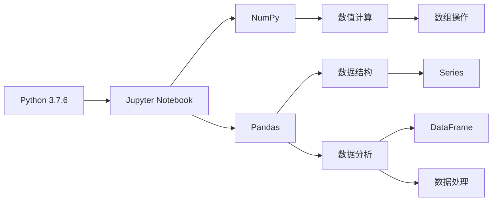

# 快速开始

<cite>
**本文引用的文件**
- [dataframe学习.ipynb](file://数据分析matpliotlib/dataframe学习.ipynb)
- [numpy.ipynb](file://数据分析matpliotlib/numpy.ipynb)
- [series学习.ipynb](file://数据分析matpliotlib/series学习.ipynb)
</cite>

## 目录
1. [简介](#简介)
2. [项目结构](#项目结构)
3. [核心组件](#核心组件)
4. [架构概览](#架构概览)
5. [详细组件分析](#详细组件分析)
6. [依赖关系分析](#依赖关系分析)
7. [性能考虑](#性能考虑)
8. [故障排除指南](#故障排除指南)
9. [结论](#结论)

## 简介

本指南旨在帮助您快速搭建数据分析学习环境，专注于Python 3.7.6环境配置和Jupyter Notebook的使用。该数据分析项目包含三个核心学习文件：NumPy基础学习、Pandas Series学习和DataFrame学习，涵盖了数据科学入门所需的核心概念。

该项目特别适合初学者，提供了从基础数据结构到高级数据分析操作的完整学习路径。通过本指南，您将学会如何配置Python环境、安装必要的开发工具、运行Jupyter Notebook以及验证环境配置的正确性。

## 项目结构

该项目采用简洁明了的文件组织方式，每个学习主题独立成章：

**图表来源**
- [numpy.ipynb:1-746](file://数据分析matpliotlib/numpy.ipynb#L1-L746)
- [series学习.ipynb:1-92](file://数据分析matpliotlib/series学习.ipynb#L1-L92)
- [dataframe学习.ipynb:1-357](file://数据分析matpliotlib/dataframe学习.ipynb#L1-L357)

**章节来源**
- [numpy.ipynb:1-746](file://数据分析matpliotlib/numpy.ipynb#L1-L746)
- [series学习.ipynb:1-92](file://数据分析matpliotlib/series学习.ipynb#L1-L92)
- [dataframe学习.ipynb:1-357](file://数据分析matpliotlib/dataframe学习.ipynb#L1-L357)

## 核心组件

### Python 3.7.6 环境要求

根据项目文件分析，所有Notebook文件都明确导入了以下核心库：
- **NumPy**: 用于数值计算和数组操作
- **Pandas**: 用于数据结构和数据分析

这些库是数据科学领域的标准工具，提供了高效的数据处理能力。

### Jupyter Notebook 配置

项目中的Notebook文件具有以下特征：
- 使用Python 3内核
- 支持交互式编程环境
- 包含完整的代码示例和输出结果
- 提供逐步学习的学习路径

**章节来源**
- [numpy.ipynb:48-48](file://数据分析matpliotlib/numpy.ipynb#L48-L48)
- [series学习.ipynb:12-12](file://数据分析matpliotlib/series学习.ipynb#L12-L12)
- [dataframe学习.ipynb:14-15](file://数据分析matpliotlib/dataframe学习.ipynb#L14-L15)

## 架构概览

该项目采用分层学习架构，从基础数据结构到高级数据分析操作：

**图表来源**
- [numpy.ipynb:62-161](file://数据分析matpliotlib/numpy.ipynb#L62-L161)
- [series学习.ipynb:13-27](file://数据分析matpliotlib/series学习.ipynb#L13-L27)
- [dataframe学习.ipynb:17-23](file://数据分析matpliotlib/dataframe学习.ipynb#L17-L23)

## 详细组件分析

### NumPy 学习模块

NumPy学习模块涵盖了数组操作的核心概念：

#### ndarray 创建方法
- **0维数组**: 用于标量值表示
- **1维数组**: 用于向量操作
- **2维数组**: 用于矩阵操作
- **3维数组**: 用于多维数据结构

#### 数组属性与特性
- **多维性**: 支持任意维度的数组
- **同质性**: 数组元素必须为相同类型
- **内存效率**: 高效的内存存储和访问

#### 统计函数
- 基础统计：求和、平均值、中位数
- 分布统计：方差、标准差、分位数
- 累积函数：累计和、累计积

**章节来源**
- [numpy.ipynb:62-161](file://数据分析matpliotlib/numpy.ipynb#L62-L161)
- [numpy.ipynb:688-722](file://数据分析matpliotlib/numpy.ipynb#L688-L722)

### Pandas Series 学习模块

Series学习模块专注于一维数据结构：

#### Series 创建与配置
- **默认索引**: 自动分配数字索引
- **自定义索引**: 用户定义标签索引
- **命名Series**: 为数据集设置名称

#### 数据访问方法
- **loc索引器**: 基于标签的索引访问
- **iloc索引器**: 基于位置的索引访问
- **at/iat索引器**: 单个元素的快速访问

#### 数据操作
- **头部显示**: 显示前n个元素
- **尾部显示**: 显示后n个元素
- **动态扩展**: 添加新的数据项

**章节来源**
- [series学习.ipynb:13-27](file://数据分析matpliotlib/series学习.ipynb#L13-L27)

### Pandas DataFrame 学习模块

DataFrame学习模块涵盖结构化数据的综合应用：

#### DataFrame 创建方法
- **Series创建**: 从多个Series构建
- **字典创建**: 从字典数据源构建
- **索引与列配置**: 自定义行列标识

#### 数据筛选与查询
- **列访问**: 基于列名的数据提取
- **条件筛选**: 基于条件表达式的过滤
- **布尔索引**: 使用布尔条件进行筛选

#### 数据处理功能
- **基本统计**: 头部、尾部数据查看
- **缺失值检测**: 缺失数据识别
- **重复值检测**: 重复数据识别
- **数据采样**: 随机数据抽取
- **排序操作**: 多列排序功能
- **Top-N选择**: 最大值选择功能

**章节来源**
- [dataframe学习.ipynb:17-23](file://数据分析matpliotlib/dataframe学习.ipynb#L17-L23)
- [dataframe学习.ipynb:137-141](file://数据分析matpliotlib/dataframe学习.ipynb#L137-L141)
- [dataframe学习.ipynb:177-178](file://数据分析matpliotlib/dataframe学习.ipynb#L177-L178)
- [dataframe学习.ipynb:257-258](file://数据分析matpliotlib/dataframe学习.ipynb#L257-L258)

## 依赖关系分析

### 核心库依赖

**图表来源**
- [numpy.ipynb:48-48](file://数据分析matpliotlib/numpy.ipynb#L48-L48)
- [series学习.ipynb:12-12](file://数据分析matpliotlib/series学习.ipynb#L12-L12)
- [dataframe学习.ipynb:14-15](file://数据分析matpliotlib/dataframe学习.ipynb#L14-L15)

### 环境依赖层次

| 依赖层级 | 库名称 | 功能描述 | 版本要求 |
|---------|--------|----------|----------|
| 基础环境 | Python 3.7.6 | 编程语言环境 | 3.7.6 |
| 开发环境 | Jupyter Notebook | 交互式编程 | 最新版本 |
| 核心库 | NumPy | 数值计算 | 最新版本 |
| 核心库 | Pandas | 数据分析 | 最新版本 |

**章节来源**
- [numpy.ipynb:48-48](file://数据分析matpliotlib/numpy.ipynb#L48-L48)
- [series学习.ipynb:12-12](file://数据分析matpliotlib/series学习.ipynb#L12-L12)
- [dataframe学习.ipynb:14-15](file://数据分析matpliotlib/dataframe学习.ipynb#L14-L15)

## 性能考虑

### 内存优化策略

1. **数据类型选择**: 合理选择NumPy数组的数据类型以节省内存
2. **数据结构选择**: 在Series和DataFrame之间选择最适合的数据结构
3. **批量操作**: 利用向量化操作替代循环操作

### 计算效率优化

1. **向量化计算**: 使用NumPy的向量化操作提高计算速度
2. **内存映射**: 对大型数据集使用内存映射技术
3. **分块处理**: 对超大数据集采用分块处理策略

## 故障排除指南

### 常见安装问题

#### Python 3.7.6 安装问题
**问题**: Python版本不兼容
**解决方案**: 
- 卸载当前Python版本
- 下载Python 3.7.6安装包
- 确保添加到系统PATH环境变量

#### Jupyter Notebook 安装问题
**问题**: Jupyter无法启动或找不到内核
**解决方案**:
- 重新安装Jupyter: `pip install jupyter`
- 安装Python内核: `python -m ipykernel install --user --name python3`
- 检查内核列表: `jupyter kernelspec list`

#### 依赖库安装问题
**问题**: NumPy或Pandas安装失败
**解决方案**:
- 更新pip: `pip install --upgrade pip`
- 使用国内镜像源: `pip install -i https://pypi.tuna.tsinghua.edu.cn/simple numpy`
- 清理缓存: `pip cache purge`

#### 环境验证问题
**问题**: 导入库时出现错误
**解决方案**:
- 验证Python路径: `which python3`
- 检查库安装位置: `pip show numpy pandas`
- 重新安装问题库: `pip uninstall numpy pandas && pip install numpy pandas`

### 运行时错误诊断

#### Notebook执行错误
**问题**: Cell执行失败
**解决方案**:
- 重启内核: Kernel -> Restart
- 检查语法错误: 逐行检查代码
- 清除输出: Cell -> Current Outputs -> Clear

#### 数据类型错误
**问题**: 数组操作时报错
**解决方案**:
- 检查数组维度: `print(array.shape)`
- 验证数据类型: `print(array.dtype)`
- 转换数据类型: `array.astype(float)`

**章节来源**
- [numpy.ipynb:177-178](file://数据分析matpliotlib/numpy.ipynb#L177-L178)
- [series学习.ipynb:13-27](file://数据分析matpliotlib/series学习.ipynb#L13-L27)
- [dataframe学习.ipynb:17-23](file://数据分析matpliotlib/dataframe学习.ipynb#L17-L23)

## 结论

本快速开始指南为您提供了搭建数据分析学习环境的完整路径。通过遵循本指南，您将能够：

1. **成功配置Python 3.7.6环境**，确保与项目兼容
2. **安装并配置Jupyter Notebook**，获得最佳的学习体验
3. **验证所有依赖库的正确安装**，包括NumPy和Pandas
4. **理解项目的学习架构**，从基础到高级的渐进式学习路径
5. **掌握常见问题的解决方法**，确保学习过程顺畅

建议按照以下顺序完成环境搭建：
1. 验证Python 3.7.6安装
2. 安装Jupyter Notebook
3. 安装NumPy和Pandas
4. 运行第一个Notebook文件
5. 逐步学习后续模块

通过系统性的学习和实践，您将建立起扎实的数据分析基础，为更高级的数据科学项目做好准备。