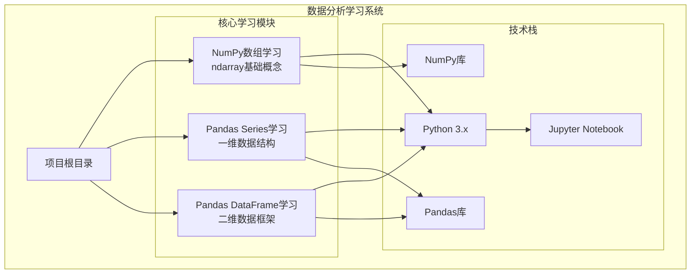
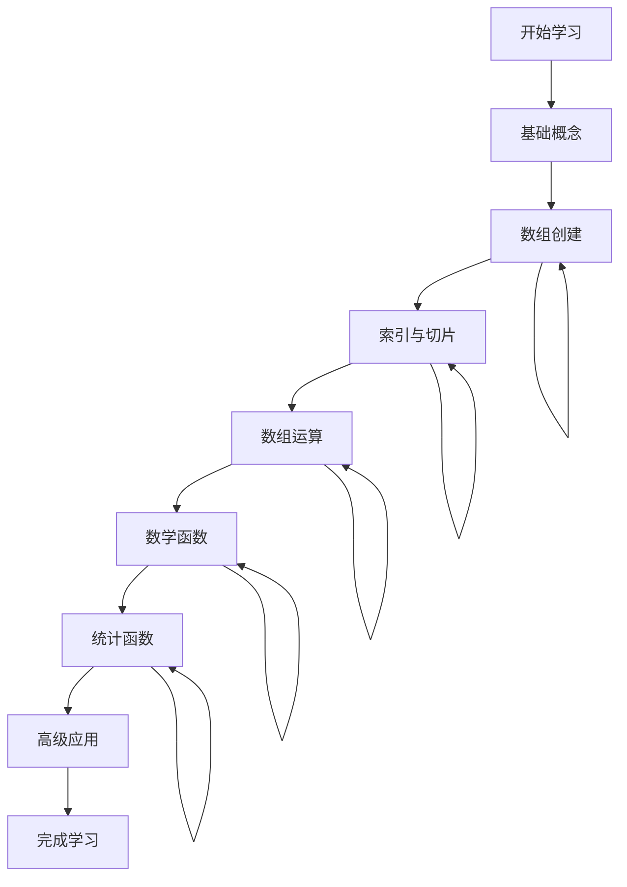
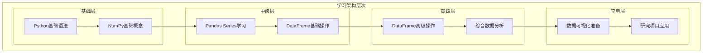
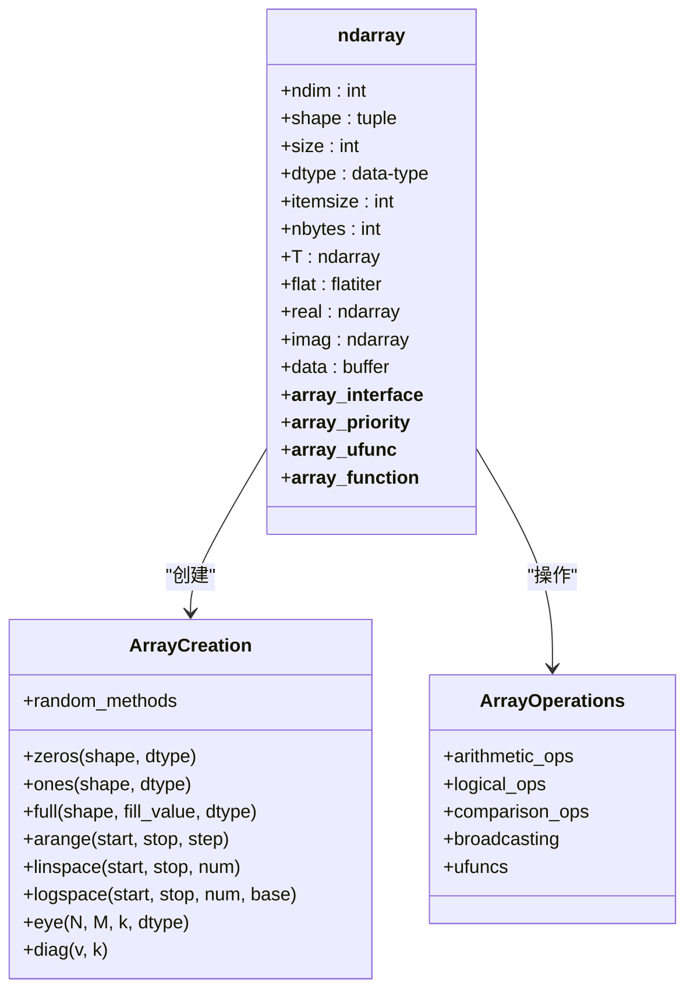
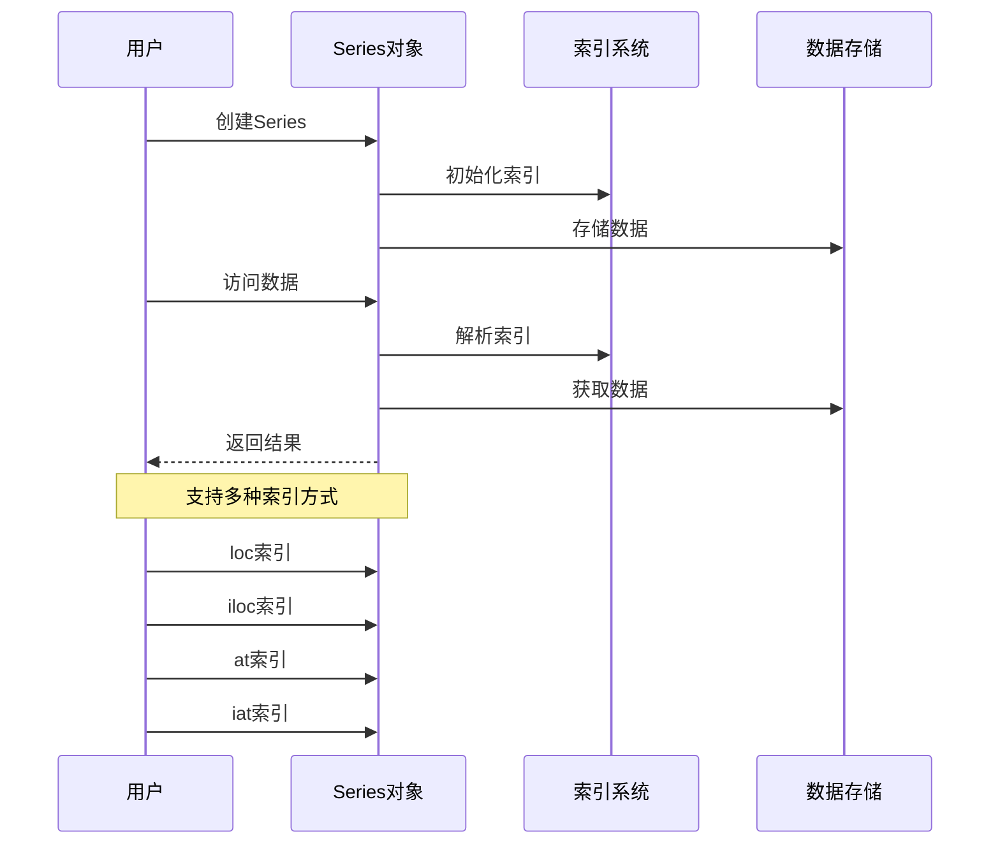
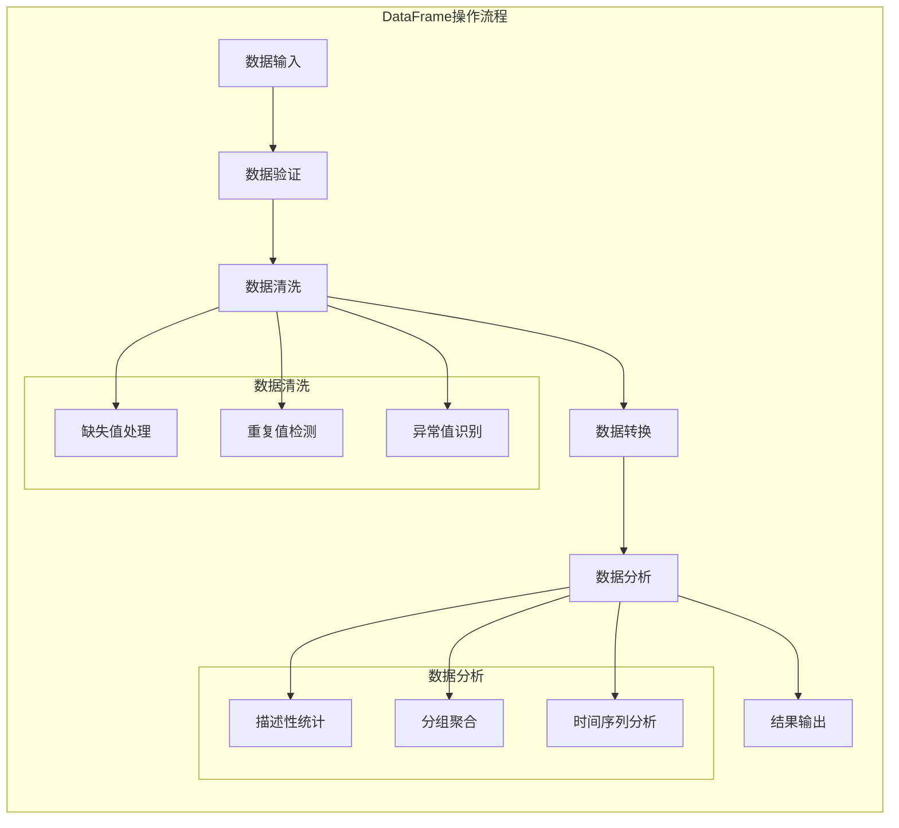
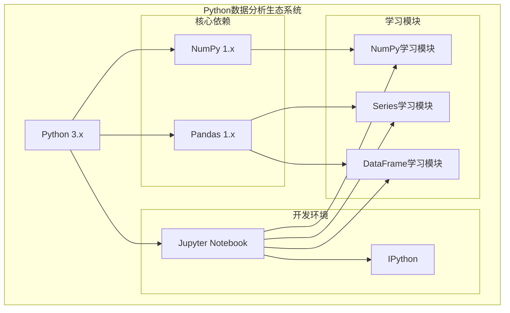

# 项目概述

<cite>
**本文档引用的文件**
- [numpy.ipynb](file://数据分析matpliotlib/numpy.ipynb)
- [series学习.ipynb](file://数据分析matpliotlib/series学习.ipynb)
- [dataframe学习.ipynb](file://数据分析matpliotlib/dataframe学习.ipynb)
</cite>

## 目录
1. [项目简介](#项目简介)
2. [项目结构](#项目结构)
3. [核心学习模块](#核心学习模块)
4. [架构概览](#架构概览)
5. [详细组件分析](#详细组件分析)
6. [依赖关系分析](#依赖关系分析)
7. [性能考虑](#性能考虑)
8. [故障排除指南](#故障排除指南)
9. [结论](#结论)

## 项目简介

本项目是一个专为研究生设计的Python数据分析学习系统，旨在为学生提供从基础到高级的渐进式学习体验。项目围绕Python数据分析生态系统的核心组件构建，重点涵盖NumPy数组处理、Pandas Series数据结构和Pandas DataFrame数据框架三大核心模块。

该项目采用循序渐进的教学设计理念，从最基础的数组概念开始，逐步深入到复杂的数据操作和分析技术。通过三个相互关联的学习模块，学生可以建立扎实的数据分析基础，为后续学习matplotlib等可视化库以及其他高级数据分析技术做好充分准备。

### 项目目标

- **知识目标**：掌握Python数据分析生态系统的核心工具和技术
- **技能目标**：培养数据处理、分析和可视化的实践能力
- **思维目标**：建立系统性的数据分析思维模式
- **应用目标**：为实际研究项目中的数据处理需求提供技术支持

### 适用人群

- 研究生阶段的计算机科学、统计学、经济学等相关专业学生
- 需要进行数据分析但缺乏系统训练的研究人员
- 希望巩固Python数据分析基础的在校大学生
- 转行进入数据科学领域的专业人士

## 项目结构

项目采用简洁而高效的学习模块化组织方式，每个模块专注于特定的数据分析概念和技术：

**图表来源**
- [numpy.ipynb:1-746](file://数据分析matpliotlib/numpy.ipynb#L1-L746)
- [series学习.ipynb:1-92](file://数据分析matpliotlib/series学习.ipynb#L1-L92)
- [dataframe学习.ipynb:1-357](file://数据分析matpliotlib/dataframe学习.ipynb#L1-L357)

### 文件组织特点

- **模块化设计**：每个学习主题独立成章，便于按需学习
- **渐进式结构**：从简单到复杂的知识递进安排
- **实践导向**：每个概念都配有相应的代码示例和练习
- **前后呼应**：各模块间存在自然的知识衔接和依赖关系

**章节来源**
- [numpy.ipynb:1-746](file://数据分析matpliotlib/numpy.ipynb#L1-L746)
- [series学习.ipynb:1-92](file://数据分析matpliotlib/series学习.ipynb#L1-L92)
- [dataframe学习.ipynb:1-357](file://数据分析matpliotlib/dataframe学习.ipynb#L1-L357)

## 核心学习模块

### NumPy数组学习模块

NumPy作为Python数据分析的基础库，提供了高性能的多维数组对象和丰富的数学函数。该模块涵盖了从基础数组概念到高级数组操作的完整知识体系。

#### 主要学习内容

- **ndarray基础概念**：理解多维数组的特性和优势
- **数组创建方法**：掌握各种数组初始化技术
- **数组索引与切片**：学习高效的元素访问方式
- **数组运算**：探索向量化操作和广播机制
- **数学函数**：熟悉常用的数学变换和统计函数

#### 学习路径设计

**图表来源**
- [numpy.ipynb:8-722](file://数据分析matpliotlib/numpy.ipynb#L8-L722)

### Pandas Series学习模块

Series是一维标记数组，是Pandas库的核心数据结构之一。该模块专注于一维数据的创建、操作和分析技术。

#### 主要学习内容

- **Series创建**：多种创建方式和自定义配置
- **索引系统**：显式和隐式索引的使用
- **数据访问**：loc、iloc、at、iat等不同访问方式
- **数据操作**：基本的数据筛选和变换操作
- **统计分析**：Series级别的统计计算功能

#### 技术特色

- **灵活的索引系统**：支持自定义标签索引
- **强大的数据类型**：支持多种数据类型的统一处理
- **丰富的操作接口**：提供直观易用的操作方法

**章节来源**
- [series学习.ipynb:10-68](file://数据分析matpliotlib/series学习.ipynb#L10-L68)

### Pandas DataFrame学习模块

DataFrame是二维表格型数据结构，是数据分析中最常用的数据容器。该模块涵盖数据框的创建、操作、查询和分析等核心功能。

#### 主要学习内容

- **DataFrame创建**：从Series、字典等多种方式创建
- **数据选择**：行列数据的选择和过滤
- **数据清洗**：缺失值检测、重复值处理等
- **数据排序**：按列或多个列进行排序
- **数据筛选**：条件筛选和复杂查询操作

#### 应用价值

- **真实场景模拟**：提供接近实际工作环境的练习
- **综合技能训练**：整合前面学到的各种操作技巧
- **问题解决导向**：针对常见数据分析任务提供解决方案

**章节来源**
- [dataframe学习.ipynb:13-246](file://数据分析matpliotlib/dataframe学习.ipynb#L13-L246)

## 架构概览

项目采用分层渐进的学习架构，确保学生能够循序渐进地掌握数据分析技能：

### 学习设计理念

- **渐进式难度**：从简单到复杂，从具体到抽象
- **理论与实践结合**：每个概念都配有相应的代码实现
- **前后知识衔接**：模块间存在自然的知识递进关系
- **实用导向**：注重实际应用场景和问题解决

**图表来源**
- [numpy.ipynb:1-746](file://数据分析matpliotlib/numpy.ipynb#L1-L746)
- [series学习.ipynb:1-92](file://数据分析matpliotlib/series学习.ipynb#L1-L92)
- [dataframe学习.ipynb:1-357](file://数据分析matpliotlib/dataframe学习.ipynb#L1-L357)

## 详细组件分析

### NumPy模块深度解析

#### 数组维度与特性

NumPy的核心是ndarray对象，它提供了多维数组的高效存储和操作能力：

**图表来源**
- [numpy.ipynb:53-491](file://数据分析matpliotlib/numpy.ipynb#L53-L491)

#### 数组创建策略

项目展示了多种数组创建方法，体现了NumPy在数据准备阶段的强大功能：

- **基础创建**：直接从Python列表创建
- **预定义数组**：zeros、ones、full等专用函数
- **序列生成**：arange、linspace、logspace等数学序列
- **特殊矩阵**：单位矩阵、对角矩阵等
- **随机数组**：多种概率分布的随机数生成

**章节来源**
- [numpy.ipynb:198-491](file://数据分析matpliotlib/numpy.ipynb#L198-L491)

### Pandas模块综合分析

#### Series数据结构

Series作为一维数组，提供了更丰富的数据处理能力：

**图表来源**
- [series学习.ipynb:10-68](file://数据分析matpliotlib/series学习.ipynb#L10-L68)

#### DataFrame数据框架

DataFrame提供了表格型数据的完整解决方案：

**图表来源**
- [dataframe学习.ipynb:13-246](file://数据分析matpliotlib/dataframe学习.ipynb#L13-L246)

**章节来源**
- [dataframe学习.ipynb:13-246](file://数据分析matpliotlib/dataframe学习.ipynb#L13-L246)

## 依赖关系分析

### 技术栈依赖

项目构建在成熟的Python数据分析生态系统之上，各组件间存在明确的依赖关系：

### 模块间依赖关系

项目中的三个学习模块形成了清晰的依赖层次：

- **NumPy模块**：作为最基础的模块，为其他两个模块提供数组操作基础
- **Series模块**：依赖NumPy的数组功能，扩展为一维数据结构
- **DataFrame模块**：同时依赖NumPy和Pandas的功能，提供完整的二维数据处理能力

### 版本兼容性

- **Python版本**：支持Python 3.x系列
- **NumPy版本**：兼容NumPy 1.x系列的主要功能
- **Pandas版本**：兼容Pandas 1.x系列的标准API

**图表来源**
- [numpy.ipynb:724-745](file://数据分析matpliotlib/numpy.ipynb#L724-L745)
- [series学习.ipynb:70-91](file://数据分析matpliotlib/series学习.ipynb#L70-L91)
- [dataframe学习.ipynb:335-357](file://数据分析matpliotlib/dataframe学习.ipynb#L335-L357)

**章节来源**
- [numpy.ipynb:724-745](file://数据分析matpliotlib/numpy.ipynb#L724-L745)
- [series学习.ipynb:70-91](file://数据分析matpliotlib/series学习.ipynb#L70-L91)
- [dataframe学习.ipynb:335-357](file://数据分析matpliotlib/dataframe学习.ipynb#L335-L357)

## 性能考虑

### 内存效率优化

- **向量化操作**：NumPy的向量化操作比纯Python循环快几个数量级
- **内存布局**：连续内存存储提高了缓存命中率
- **数据类型优化**：合理选择数据类型可以减少内存占用

### 处理速度提升

- **C语言实现**：底层使用C语言实现，提供高性能计算
- **广播机制**：避免不必要的数据复制，提高运算效率
- **就地修改**：支持就地修改操作，减少内存分配

### 实践建议

- **批量操作**：尽量使用向量化操作而非循环
- **数据类型选择**：根据数据范围选择合适的数据类型
- **内存管理**：及时释放不需要的大对象

## 故障排除指南

### 常见问题及解决方案

#### 导入错误

**问题**：导入NumPy或Pandas时出现ImportError
**解决方案**：
- 确认Python环境正确安装
- 检查包是否正确安装
- 验证Python版本兼容性

#### 数组维度不匹配

**问题**：数组运算时报维度不匹配错误
**解决方案**：
- 检查数组的shape属性
- 利用广播机制进行维度扩展
- 使用reshape或resize调整数组形状

#### 内存不足

**问题**：处理大数据集时出现内存不足
**解决方案**：
- 分批处理大数据
- 使用适当的数据类型
- 及时删除不需要的变量

### 调试技巧

- **使用print调试**：输出关键变量的状态
- **检查数据类型**：确保数据类型符合预期
- **验证运算结果**：通过简单的测试用例验证逻辑

**章节来源**
- [numpy.ipynb:163-191](file://数据分析matpliotlib/numpy.ipynb#L163-L191)
- [series学习.ipynb:10-68](file://数据分析matpliotlib/series学习.ipynb#L10-L68)
- [dataframe学习.ipynb:13-246](file://数据分析matpliotlib/dataframe学习.ipynb#L13-L246)

## 结论

本项目为研究生提供了一个系统、完整且实用的Python数据分析学习平台。通过三个精心设计的学习模块，学生可以从零基础开始，逐步掌握现代数据分析的核心技能。

### 学习成果预期

- **技术能力**：熟练掌握NumPy、Pandas等核心工具的使用
- **分析思维**：建立规范的数据分析流程和思维方式
- **实践技能**：具备解决实际数据分析问题的能力
- **扩展基础**：为学习matplotlib、scikit-learn等高级库奠定基础

### 项目特色

- **渐进式设计**：从基础概念到高级应用的自然过渡
- **实践导向**：每个概念都配有具体的代码示例
- **系统完整**：覆盖数据分析的主要技术栈
- **易于上手**：友好的学习界面和清晰的指导

### 后续学习建议

完成本项目后，建议继续学习：
- matplotlib数据可视化库
- scikit-learn机器学习库
- SQL数据库操作
- 大数据处理技术

通过本项目的系统学习，学生将具备扎实的数据分析基础，能够胜任各类研究项目中的数据处理和分析任务，为未来的学术研究和职业发展打下坚实的技术基础。